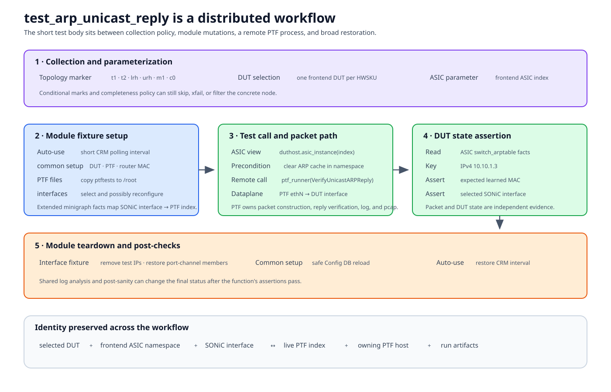

# End-to-end annotated test

This chapter follows the current
`tests/arp/test_arpall.py::test_arp_unicast_reply` path. It is useful because
the short test body depends on collection markers, DUT/ASIC selection,
module-scoped remote mutations, PTF file deployment, a remote PTF test, DUT
state verification, and two layers of cleanup.



This is a reading exercise, not a claim that ARP is the canonical style for
every new test. Always inspect the version in the branch under test.

## Source trail

| Source | Role |
|---|---|
| `tests/arp/test_arpall.py` | Test marker, test body, remote PTF call, ARP-table assertions |
| `tests/arp/conftest.py` | Interface selection, topology-specific mutations, polling interval, setup and restoration |
| `tests/arp/arp_utils.py` | ARP cache and diagnostic helpers |
| `tests/ptf_runner.py` | Remote PTF process and artifact handling |
| `ansible/roles/test/files/ptftests/py3/arptest.py` | PTF packet algorithm |
| `tests/conftest.py` and shared plugins | DUT/ASIC parameterization, sanity, log analysis, reporting |

## 1. Collection: is this item eligible?

The module currently declares:

```python
pytestmark = [
    pytest.mark.topology("t1", "t2", "lrh", "urh", "m1", "c0")
]
```

The test is not collected for execution merely because `arp/` exists. The
selected testbed topology must match this compatibility set, and
conditional/completeness plugins may add further decisions.

The function also requests `enum_frontend_asic_index`. Pytest parameter
generation turns the function into a concrete node for a selected frontend
ASIC. Another selector used by its fixtures chooses one frontend DUT per
hardware SKU.

Record both hostname and ASIC index when reporting a failure.

## 2. Auto-used module setup

The directory's `conftest.py` has an auto-used module fixture that changes
the CRM polling interval on every frontend node to a short value. It waits for
counters to update and, after the module, restores the documented default.

Shared auto-used plugins may also:

- run pre-test sanity and recovery;
- place log-analysis markers;
- start resource/process monitoring; and
- create report sections.

None appear in the test function signature, but all can affect the result.

## 3. Explicit fixture graph

The test requests:

```python
def test_arp_unicast_reply(
    common_setup_teardown,
    intfs_for_test,
    enum_frontend_asic_index,
):
```

### `common_setup_teardown`

This module-scoped fixture:

1. selects the DUT through
   `enum_rand_one_per_hwsku_frontend_hostname`;
2. obtains the ASIC-specific router MAC;
3. copies the `ptftests` directory to `/root` on the PTF host; and
4. yields `(duthost, ptfhost, router_mac)`.

Its `finally` block performs a safe config reload from Config DB. That broad
recovery is part of the module contract, not part of the individual
assertion.

### `intfs_for_test`

This module-scoped fixture:

1. obtains the same selected DUT and ASIC;
2. reads extended minigraph facts using `tbinfo`;
3. filters external ports and chooses two interfaces according to topology;
4. maps each DUT interface through `minigraph_ptf_indices`;
5. for non-T0 paths, may remove selected interfaces from port-channels and add
   test IP addresses; and
6. yields interface names and PTF indices.

After tests, it removes test addresses and re-adds any modified port-channel
members.

This explains why copying the four-line test body without its conftest cannot
reproduce the behavior.

## 4. The test chooses an ASIC control object

```python
duthost, ptfhost, router_mac = common_setup_teardown
intf1, intf2, intf1_indice, intf2_indice = intfs_for_test
asichost = duthost.asic_instance(enum_frontend_asic_index)
```

`duthost` owns chassis/global operations. `asichost` scopes ARP and
interface operations to the selected ASIC namespace. `intf1` is the SONiC
interface; `intf1_indice` is its PTF mapping. They are deliberately kept as
different values.

## 5. Precondition: clear learned state

```python
clear_dut_arp_cache(duthost, asichost.cli_ns_option)
```

An ARP reply test must not pass because a previous test left the expected
neighbor entry. The namespace option keeps the operation on the selected
ASIC.

This is also a cleanup dependency: if cache clearing or namespace selection is
wrong, the packet result and final table assertion no longer test a fresh
learn.

## 6. Build the remote PTF contract

The test passes:

```python
params = {
    "acs_mac": router_mac,
    "port": intf1_indice,
    "kvm_support": True,
}
```

On one VPP KVM combination it adds `no_padding=True`, because that dataplane
does not pad the ARP reply to the Ethernet minimum frame size. This is a
narrow, documented expectation adjustment, not a mask for arbitrary packet
differences.

The selected `port` is a PTF index derived from live minigraph facts. The PTF
test must interpret it in the deployed PTF interface map.

## 7. Execute the packet algorithm remotely

```python
ptf_runner(
    ptfhost,
    "ptftests",
    "arptest.VerifyUnicastARPReply",
    "/root/ptftests",
    params=params,
    log_file=log_file,
    is_python3=True,
)
```

The runtime boundary is:

```text
pytest on management host
  -> host wrapper / remote shell
  -> PTF executable in the PTF environment
  -> arptest.VerifyUnicastARPReply
  -> PTF ethN dataplane
  -> server/fanout path
  -> selected DUT interface and ASIC
```

`ptf_runner` currently detects the compatible Python executable from the PTF
image and source file; the explicit argument should not be treated as the only
version decision. It fetches the log and pcap when configured, including on
failure.

The PTF class owns packet construction and packet-level verification. The
pytest function owns the broader environment and post-packet SONiC assertion.

## 8. Verify observed DUT state

```python
switch_arptable = asichost.switch_arptable()["ansible_facts"]
entry = switch_arptable["arptable"]["v4"]["10.10.1.3"]

pytest_assert(entry["macaddress"] == "00:06:07:08:09:00")
pytest_assert(entry["interface"] == intf1)
```

This checks two independent results:

- the expected IP-to-MAC binding was learned; and
- it was learned on the selected SONiC interface.

A packet reply alone would not prove the expected ARP-table ownership. A table
entry alone would not prove that this packet caused it. The test uses both
remote PTF behavior and DUT state to close that gap.

## 9. Cleanup and final outcome

After the function returns:

1. function-scope finalizers, if any, run;
2. module fixtures remain alive for sibling tests;
3. after the module, `intfs_for_test` restores IP and port-channel changes;
4. `common_setup_teardown` performs safe config reload;
5. the auto-used CRM fixture restores polling interval; and
6. shared log/sanity plugins inspect and report the bounded run.

Exact teardown ordering follows fixture dependencies, so inspect
`pytest --setup-show` output rather than relying only on the list above.

## Failure map

| Observation | Likely owner |
|---|---|
| Item skipped | Topology/conditional/completeness collection |
| No valid ports | `intfs_for_test`, topology, or live interface state |
| Wrong PTF index | Extended minigraph mapping or selected ASIC |
| PTF test source missing | Copy fixture or PTF image path |
| Remote PTF process fails | Packet algorithm, PTF environment, or dataplane |
| PTF passes but ARP entry absent | DUT learning/state-read boundary |
| Entry exists on wrong interface | Mapping, forwarding, or stale state |
| Test body passes but module fails | Fixture restoration, log analyzer, or sanity |

## What to learn from the example

The main lesson is not the ARP syntax. It is that a test's real contract
includes:

- collection eligibility;
- DUT and ASIC parameterization;
- fixture scopes and auto-use behavior;
- declared-to-live port translation;
- remote process and artifact boundaries;
- independent packet and DUT-state assertions; and
- restoration after partial or complete execution.

[Plugin lifecycle](plugin-lifecycle.md) expands the shared behavior that wraps
this example.
