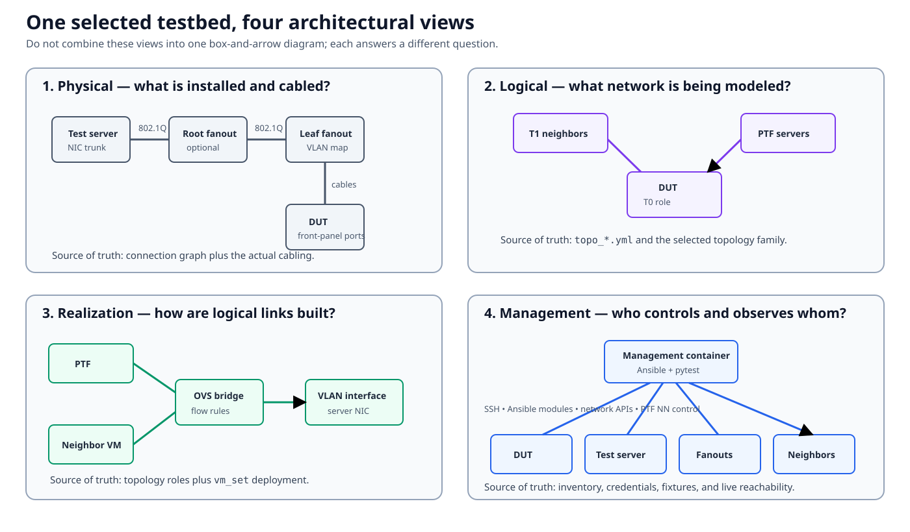
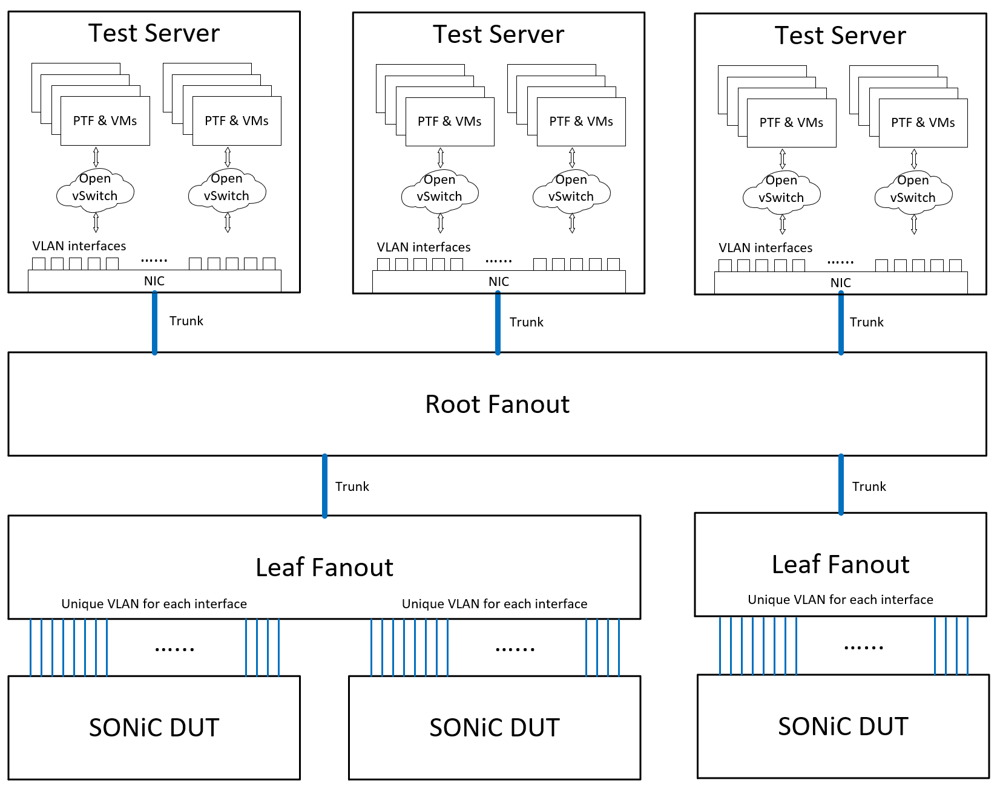
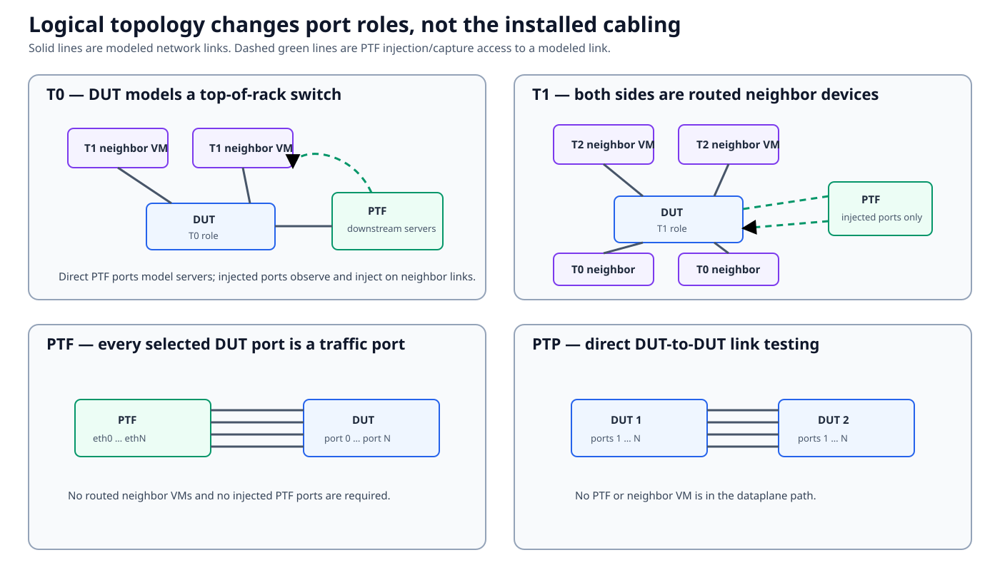
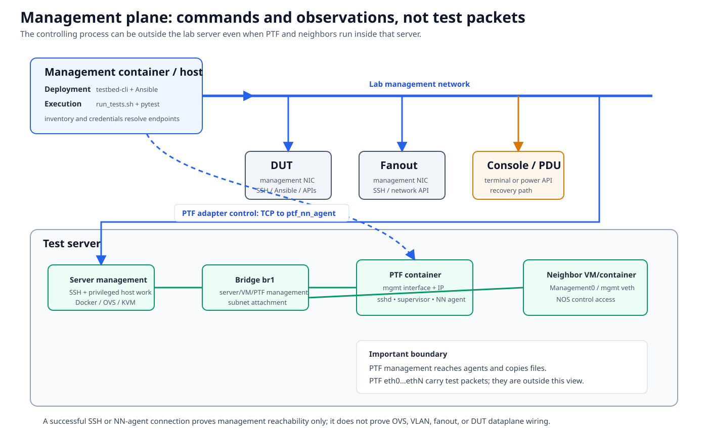
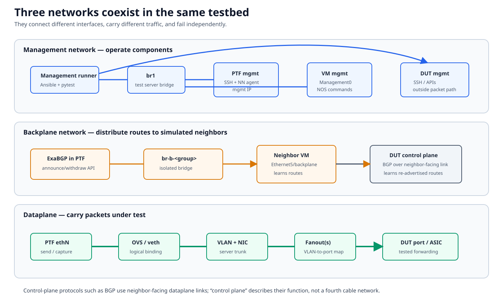
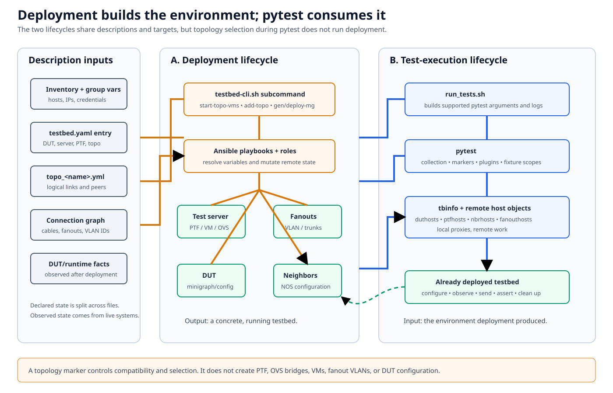
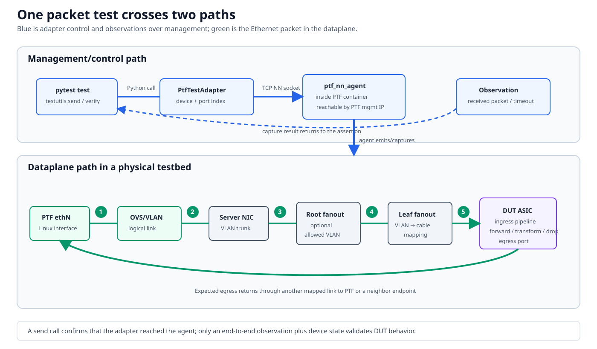
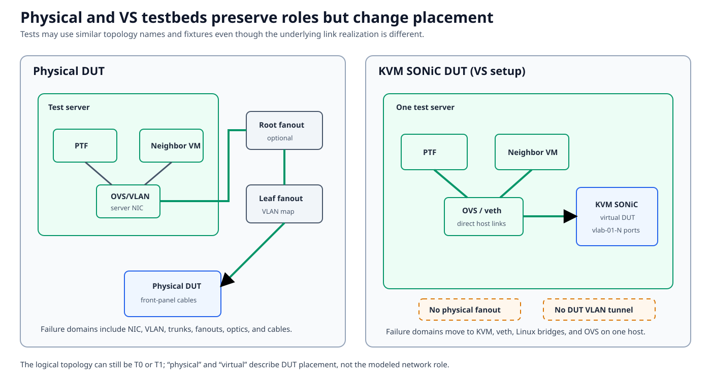

# Testbed architecture

The testbed is the architectural center of `sonic-mgmt`. Tests do not run
against a DUT in isolation: they operate a collection of physical switches,
Linux hosts, containers or VMs, virtual links, management services, and
configuration files that together model the network around the DUT.

The first trap is to compress all of that into one diagram. A single
box-and-arrow picture usually mixes four different questions:

- What equipment is installed and physically cabled?
- What network role does each DUT-facing link model?
- How does the test server realize those logical links?
- Which machine controls and observes each component?

Those are related views of one selected testbed, not one topology.

This chapter builds each view separately and then joins them by following a
packet from pytest to the DUT and back.

## Documentation basis

This chapter is derived from the existing `sonic-mgmt` documentation first,
with current code and topology files used to verify names and behavior. The
following source trail makes that relationship explicit.

| Existing source | What this chapter takes from it |
|---|---|
| [SONiC Testbed Topology][testbed-overview] | Physical cabling, topology families, direct and injected PTF interfaces, OVS rules, management and backplane networks |
| [Testbed Setup][testbed-setup] | The management container, inventory, connection graph, testbed definition, and deployment workflow |
| [Testbed Internals][testbed-internal] | Linux namespaces, PTF interfaces, OVS bridges, VLAN subinterfaces, and VM connectivity |
| [New Testbed Configuration][testbed-configuration] | How declared topology and inventory data select concrete devices and links |
| [Testbed Routing][testbed-routing] | ExaBGP, backplane bridges, neighbor VMs, and route advertisement toward the DUT |
| [VS Setup][vs-setup] | Placement and link realization when the SONiC DUT is a KVM VM |
| [Multiple Servers][multi-server] | One PTF container per server and per-device interface placement in distributed testbeds |
| [Pytest overview][pytest-overview], [running tests][pytest-run], and [PTF adapter][ptfadapter] | How pytest obtains remote host objects and controls PTF packet I/O |

Inventory files and repository directories are therefore *descriptions and
implementation inputs*. They are not physical components of the lab. The
diagrams below show systems, links, and runtime boundaries; the text explains
which files describe them.

## Physical topology: installed equipment and cabling

A standard physical testbed connects a test server to one or more DUTs through
fanout switches. The existing overview uses the following canonical physical
diagram.

_Source: [SONiC Testbed Topology — Physical Topology][testbed-physical]._

Read the physical path from the test server toward a DUT:

1. A test-server NIC carries many IEEE 802.1Q VLANs on a trunk.
2. An optional **root fanout** transports those VLANs between test servers and
   leaf fanouts. A small testbed can omit it and connect the server trunk
   directly to a leaf fanout.
3. A **leaf fanout** maps each testbed VLAN to a physical DUT-facing port.
4. A front-panel cable connects that leaf-fanout port to a DUT port.

Fanouts are not simulated neighbors. Their primary job in this architecture is
transport: bridge a server-side VLAN tunnel to a specific cable and physical
DUT port. A routed T1 or T2 neighbor is normally a VM or container on the test
server; its packets use the same server, VLAN, and fanout infrastructure.

| Physical component | Responsibility | Described by |
|---|---|---|
| Test server | Hosts PTF, neighbor VMs/containers, OVS, VLAN interfaces, and sometimes a VS DUT | Inventory and the server field in `testbed.yaml` |
| Server NIC and trunk | Carries the VLANs assigned to logical testbed links | Inventory variables, connection graph, and deployed host state |
| Root fanout | Optionally aggregates trunks across servers or DUT racks | Connection graph and fanout inventory |
| Leaf fanout | Maps a VLAN to each DUT-facing physical port | Connection graph plus fanout deployment |
| DUT | Runs SONiC and presents the front-panel ports under test | Inventory, `testbed.yaml`, and DUT runtime facts |
| Console and PDU | Provide recovery when ordinary management access fails | Console/PDU inventory and lab wiring |

The connection graph is the declared source of truth for physical
connectivity: which DUT port is cabled to which fanout port, which fanout
devices participate, and which VLAN IDs carry those links through the server
side. It cannot prove that the live cable, optic, trunk, or fanout
configuration is healthy; deployment and sanity checks compare the
declaration with observed state.

### What the test server adds to the physical path

The test server is more than a traffic-generator appliance. It synthesizes the
network surrounding the DUT:

- A **PTF container** owns Linux interfaces named `eth0`, `eth1`, and so
  on, and sends or captures frames on them.
- **Neighbor VMs or containers** run routing stacks that model devices above
  or below the DUT.
- **OVS bridges and veth pairs** join a PTF port, a neighbor interface, and a
  DUT-facing server VLAN when a logical link needs all three endpoints.
- **VLAN subinterfaces** place traffic on the correct test-server NIC trunk.
- Topology-specific services add mux, DPU, NIC, traffic-generator, or protocol
  behavior where required.

The resulting physical dataplane is:

`PTF/neighbor -> OVS or direct VLAN link -> server NIC trunk -> optional root fanout -> leaf fanout -> cable -> DUT port`

This per-port VLAN tunnel is what lets a fixed cable plant implement different
logical network roles without recabling the rack for each test.

## Logical topology: the network being modeled

Physical topology answers “where are the cables?” Logical topology answers
“what does each DUT-facing link mean to this test?”

A topology file such as `ansible/vars/topo_t0.yml` assigns roles and indices:
which links belong to neighbor VMs, which PTF indices model servers, and which
VM interfaces correspond to which DUT-facing links. Deployment combines that
logical declaration with the selected testbed and connection graph.

| Family | Modeled role | Relationship to PTF |
|---|---|---|
| `t0` | DUT is a top-of-rack switch. Upstream ports face simulated T1 neighbors; downstream ports face modeled servers. | Downstream server links are direct PTF ports. PTF is also injected into upstream neighbor links for observation and injection. |
| `t1` | DUT is between simulated T0 neighbors below and T2 neighbors above. | PTF uses injected ports on neighbor-to-DUT links; it is not a set of direct downstream servers. |
| `t2` | Multiple DUTs and neighbor groups model a larger multi-tier network. | PTF placement follows the topology declaration and may span DUTs or servers. |
| `ptf` | Selected DUT ports are exposed as traffic ports without routed neighbor VMs. | PTF attaches directly to the selected DUT-facing links. |
| `ptp` | DUTs are connected directly for point-to-point link tests. | PTF and neighbor VMs are absent from that dataplane path. |

Other families such as M0, MX, dual-ToR, chassis, and SmartSwitch/DPU extend
the same vocabulary. They add DUTs, neighbors, services, or link roles; they
do not erase the distinction between physical cabling and logical intent.

Two practical consequences follow:

- The same installed DUT-to-fanout cable can model a server-facing link in one
  selected topology and a neighbor-facing link in another.
- “The T0 topology is correct” is ambiguous. The logical declaration may be
  correct while its OVS/VLAN realization is wrong, or the realization may be
  correct while a physical trunk or cable is broken.

## Realization: how logical links are built

The T0 case exposes the two most important link types.

The names and numbers in the diagram are representative; the selected
topology and connection graph determine the actual values.

### Direct host interfaces

A T0 downstream link models a server attached directly to the DUT. During
deployment, the server-side VLAN interface for that DUT link is moved into the
PTF container’s network namespace and renamed to its assigned `ethN`.
Packets sent on that PTF interface therefore enter the VLAN tunnel without a
neighbor VM or a three-port OVS bridge.

Conceptually:

`PTF ethN -> server VLAN subinterface -> NIC trunk -> fanout path -> DUT port`

The `host_interfaces` portion of a topology declaration identifies these
direct links. “Direct” refers to the Linux realization on the test server; a
physical testbed can still contain root and leaf fanouts between the server
and DUT.

### Injected PTF interfaces

An upstream T0 link must behave as a routed neighbor-to-DUT link while still
allowing PTF to inject and observe packets. Deployment creates an OVS bridge
with three attached endpoints:

1. the neighbor VM interface;
2. one end of a PTF veth pair; and
3. the DUT-facing VLAN subinterface on the server NIC.

OVS flow rules preserve the modeled link while giving PTF controlled access:

- traffic from the neighbor goes to the DUT;
- traffic from the DUT goes to both the neighbor and PTF;
- traffic injected by PTF goes to the DUT.

The PTF side appears as another `ethN`, but it is not equivalent to a direct
server-facing PTF port. Its position is a tap/injection endpoint on a modeled
neighbor link. This difference matters when interpreting packet captures,
source MAC addresses, flooding, and expected egress.

### One link has several identities

A test often needs to translate among several names for the same path:

| Layer | Example identity |
|---|---|
| SONiC | Front-panel interface such as `Ethernet0` |
| Topology | VM/interface index or `host_interfaces` PTF index |
| PTF | Device and port tuple, commonly device 0 and `ethN` |
| Test server | OVS bridge, veth endpoint, or VLAN subinterface |
| Fanout | VLAN ID and physical DUT-facing port |

Never assume those numbers are interchangeable. Use topology properties,
runtime minigraph/config facts, and connection-graph data to perform the
mapping. In a multi-server topology, the PTF identity may also include which
PTF host owns the interface.

## Management plane: who controls and observes the lab

The management plane is separate from the packet path under test.

The **management container or host** contains the `sonic-mgmt` checkout. It
runs deployment commands, Ansible playbooks, `run_tests.sh`, and pytest. Its
inventory and credentials resolve logical names to reachable endpoints.

It uses the lab management network to reach:

- DUT management interfaces for SSH, Ansible modules, CLI commands, and APIs;
- the test-server management interface for privileged Linux, Docker, OVS, and
  KVM work;
- fanout management interfaces for VLAN and port configuration;
- neighbor management interfaces for NOS configuration and state collection;
- console servers and PDUs as out-of-band recovery paths.

Inside a standard test server, the configured management bridge (commonly
`br1`) attaches the server-side management network to PTF and neighbor
VMs/containers. The PTF end of its management veth is renamed `mgmt`. That
attachment is distinct from PTF `eth0...ethN`, which carry packets under test.

The pytest process does not need to run inside PTF to use PTF interfaces.
The `ptfadapter` fixture creates a local Python adapter that opens a TCP
connection to `ptf_nn_agent` in the PTF container. The agent performs the
send, poll, and capture work on PTF Linux interfaces and returns observations
to pytest. Remote PTF tests use SSH and copied test files instead, but still
depend on management reachability.

Device fixtures follow the same proxy pattern. Objects such as `duthosts`,
`ptfhosts`, `nbrhosts`, and `fanouthosts` are local Python objects whose
methods cause work on remote systems. A fixture name is not evidence that the
component runs in the pytest process.

This yields a useful diagnostic rule: successful SSH or NN-agent connection
proves the relevant management path. It does **not** prove that an OVS bridge,
server VLAN, trunk, fanout, cable, DUT port, or ASIC path is correct.

## Management, backplane, and dataplane networks

Three network realizations coexist in a typical testbed and fail
independently.

| Network | Carries | Typical endpoints | A failure looks like |
|---|---|---|---|
| Management | SSH, Ansible, APIs, files, logs, and PTF NN control | Management runner, test server, PTF management IP, VM `Management0`, DUT/fanout management ports | Host unreachable, authentication error, Ansible timeout, NN-agent connection failure |
| Backplane | Routes injected into simulated neighbors | ExaBGP in PTF, isolated `br-b-GROUP` bridge, neighbor VM backplane interface | Routes absent in neighbor VM or never re-advertised to DUT |
| Dataplane | Ethernet packets under test and neighbor-facing protocol packets | PTF `ethN`, OVS/veth, VLAN/NIC, fanouts, DUT ports and ASIC | Send succeeds but capture times out, wrong port/VLAN, link down, unexpected forwarding |

The backplane deserves special attention. ExaBGP in PTF can advertise or
withdraw test routes over an isolated backplane bridge to a neighbor VM. The
neighbor learns those routes on its backplane interface and advertises them
again to the DUT on the modeled neighbor-facing dataplane link. The DUT does
not normally peer directly with the PTF backplane speaker.

“Control plane” is a functional description, not necessarily a fourth
physical network. BGP between a neighbor and DUT uses the neighbor-facing
dataplane link, while the management network is used to configure and inspect
that BGP session.

## Deployment builds the testbed; pytest consumes it

Deployment and test execution share descriptions and targets, but they are
different lifecycles.

### Description inputs

The selected environment is assembled from several sources:

| Input | Question it answers |
|---|---|
| Inventory and group variables | What hosts exist, where are they reachable, and what credentials or platform variables apply? |
| `testbed.yaml` entry | Which DUTs, test server, PTF container, VM set, and topology name form this testbed? |
| `topo_NAME.yml` | What logical links, neighbors, PTF indices, and topology properties should exist? |
| Connection graph | How are DUT, fanout, and server-side VLAN paths physically mapped? |
| DUT configuration/minigraph and runtime facts | What configuration was applied, and what state does the running system expose? |

Declared state is intentionally split across these files because the logical
network can be reused across different physical labs. Runtime facts are kept
separate because a file cannot prove what deployment actually produced.

### Deployment lifecycle

`ansible/testbed-cli.sh` is a front end to topology deployment operations.
Depending on the workflow, its subcommands start topology VMs, add the
topology, generate or deploy DUT configuration, and remove or stop the
topology. Ansible playbooks and roles then mutate remote state:

- create PTF and neighbor containers or VMs;
- create namespaces, veth pairs, OVS bridges, and flow rules;
- create VLAN subinterfaces and attach them to server trunks;
- configure fanout VLAN transport;
- configure neighbor routing and backplane services;
- generate and apply DUT topology configuration.

The output is a concrete, running testbed. Deployment is not just metadata
selection.

### Test-execution lifecycle

`run_tests.sh` constructs a supported pytest invocation and log layout.
Pytest then collects tests, applies markers and topology compatibility rules,
initializes plugins, and resolves fixtures. Those fixtures expose topology
information and remote host objects for the environment that deployment
already created.

A topology marker can prevent an incompatible test from running. It does not
create PTF, OVS bridges, VMs, fanout VLANs, or DUT configuration. If a test
selects correctly but the topology was not deployed correctly, collection can
succeed and packet I/O can still fail.

## Follow one packet test across both paths

A packet test crosses a management/control path and a dataplane path.

Consider a pytest test that sends a packet into a physical T0 DUT and expects
an egress packet:

1. Pytest resolves the selected testbed and obtains DUT, PTF, neighbor, and
   topology objects from fixtures.
2. Runtime facts and topology properties map a SONiC interface to the
   appropriate PTF device/port identity.
3. The test calls a PTF helper. For `ptfadapter`, a local
   `PtfTestAdapter` sends a command over the management network to
   `ptf_nn_agent`.
4. The agent emits the Ethernet frame on the selected PTF `ethN`.
5. A direct interface or OVS/veth realization connects that PTF port to the
   correct server VLAN subinterface.
6. The server NIC sends the tagged frame over its trunk.
7. The optional root fanout transports the allowed VLAN to the correct leaf
   fanout.
8. The leaf fanout maps that VLAN to the cable connected to the target DUT
   front-panel port.
9. The DUT ASIC receives, forwards, transforms, traps, or drops the packet
   according to its programmed state.
10. Expected egress returns through another mapped path to PTF or a neighbor.
    The agent returns a capture result or timeout to the test.
11. Pytest combines packet observations with DUT or neighbor state and makes
    the assertion.

A successful call at step 3 establishes adapter-to-agent communication only.
An end-to-end observation plus relevant device state is what validates DUT
behavior. This is why a timeout should be localized layer by layer instead of
immediately blamed on the feature under test.

## Physical DUT and virtual-switch placement

A VS testbed keeps many logical roles but changes where the DUT and links
exist.

With a physical DUT, the dataplane crosses a server NIC, VLAN trunks, fanouts,
optics, and cables. With the KVM VS setup, the SONiC DUT runs on the same test
server as PTF and neighbor VMs. Linux bridges, veth interfaces, and OVS connect
the virtual DUT ports directly; there is no physical fanout or DUT-facing VLAN
tunnel.

The topology may still be called T0 or T1 because those names describe the
modeled network role. “Physical” and “VS” describe DUT placement and link
realization. Tests can therefore share fixtures and topology expectations
while encountering different failure domains:

- physical: NICs, trunks, fanouts, optics, cables, and hardware ports;
- VS: KVM state, tap/veth interfaces, Linux bridges, OVS, and host resources.

The [VS Setup][vs-setup] guide should be read before treating a passing VS test
as proof that the physical transport path is healthy.

## Scaling and specialized variants

The standard diagrams are a foundation, not a claim that every lab has one
server, one DUT, and one fanout.

### Multiple test servers

A distributed testbed can place DUTs and links on different servers. The
existing [multiple-server guide][multi-server] defines device/interface tuples
that identify both the owning server and the local interface. Deployment
creates one PTF container per participating server. Tests written around a
single `ptfhost` compatibility fixture may require care; the architecture is
now a set of PTF hosts and local dataplane segments.

### Multiple DUTs and ASICs

T2, chassis, dual-ToR, and multi-ASIC environments add another mapping layer:
logical DUT role, physical DUT, ASIC namespace, front-panel port, PTF
interface, and server ownership. The same source-of-truth discipline applies,
but a single global port number is even less likely to be meaningful.

### Containers instead of VMs

cEOS or other containerized neighbors can replace vEOS/KVM neighbors while
preserving the modeled role. Placement and management mechanisms change; the
logical topology does not. PTP and direct DUT-to-DUT designs can remove PTF
and neighbors from a particular dataplane path altogether.

## Debug by boundary, not by repository directory

Start with the failing observation and locate the last boundary known to work.

| Symptom | Plane or boundary to inspect first | Useful evidence |
|---|---|---|
| Cannot create fixtures for a host | Management/configuration | Inventory resolution, credentials, selected `testbed.yaml` entry |
| PTF NN connection fails | Management | PTF management IP, `br1`, container state, supervisor/agent process, TCP reachability |
| PTF send returns but no capture appears anywhere | Dataplane realization | PTF port index, namespace interface, veth/OVS membership and flow rules |
| Correct PTF interface but wrong DUT port receives traffic | VLAN/physical mapping | Server VLAN interface, NIC trunk, connection-graph VLAN, fanout port mapping |
| DUT port is down | Physical or DUT configuration | Cable/optic, fanout port, DUT interface state, speed/FEC, minigraph/config |
| Neighbor session is absent | Neighbor-facing control plane | VM interface mapping, OVS link, neighbor configuration, DUT BGP state |
| Injected routes are absent only in the neighbor | Backplane | ExaBGP state, `br-b-GROUP`, VM backplane interface |
| Route exists but forwarding is wrong | DUT control-to-dataplane boundary | Route/neighbor/FDB state, ASIC programming evidence, packet capture |
| VS passes while hardware fails | Physical-only path | Trunk, fanouts, optics, cabling, platform-specific port behavior |

This approach also prevents a common category error: inspecting pytest marker
code when deployment never created the link, or debugging fanout VLANs when
the PTF management agent is simply unreachable.

## Continue from here

The next chapters separate the descriptions and execution machinery used
above:

1. [Topology and configuration](topology-and-configuration.md) explains how
   inventory, testbed, topology, and connection files select the environment.
2. [The pytest execution lifecycle](execution.md) follows collection, plugins,
   fixtures, test phases, and cleanup.
3. [Fixtures and device objects](fixtures-and-hosts.md) explains the local
   proxies used to operate remote components.
4. [Packet tests and PTF](packet-tests.md) covers adapter and remote-test
   packet I/O in more detail.
5. [Physical lab bring-up and operations](physical-lab.md) turns this model
   into deployment and troubleshooting steps.

For authoritative setup details, continue to use the existing source
documents linked in [Documentation basis](#documentation-basis). This chapter
is a guided synthesis of those documents, not a replacement for their
environment-specific procedures.

[testbed-overview]: https://github.com/sonic-net/sonic-mgmt/blob/master/docs/testbed/README.testbed.Overview.md
[testbed-physical]: https://github.com/sonic-net/sonic-mgmt/blob/master/docs/testbed/README.testbed.Overview.md#physical-topology
[testbed-setup]: https://github.com/sonic-net/sonic-mgmt/blob/master/docs/testbed/README.testbed.Setup.md
[testbed-internal]: https://github.com/sonic-net/sonic-mgmt/blob/master/docs/testbed/README.testbed.Internal.md
[testbed-configuration]: https://github.com/sonic-net/sonic-mgmt/blob/master/docs/testbed/README.new.testbed.Configuration.md
[testbed-routing]: https://github.com/sonic-net/sonic-mgmt/blob/master/docs/testbed/README.testbed.Routing.md
[vs-setup]: https://github.com/sonic-net/sonic-mgmt/blob/master/docs/testbed/README.testbed.VsSetup.md
[multi-server]: https://github.com/sonic-net/sonic-mgmt/blob/master/docs/testbed/README.testbed.DeployWithMultipleServers.md.md
[pytest-overview]: https://github.com/sonic-net/sonic-mgmt/blob/master/docs/tests/README.md
[pytest-run]: https://github.com/sonic-net/sonic-mgmt/blob/master/docs/tests/pytest.run.md
[ptfadapter]: https://github.com/sonic-net/sonic-mgmt/blob/master/tests/common/plugins/ptfadapter/README.md
