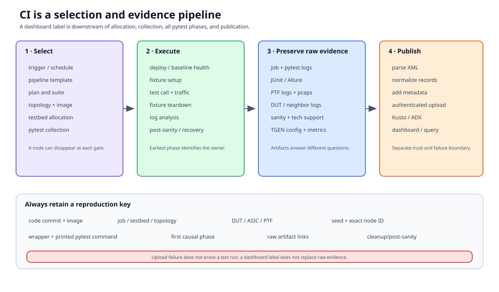

# CI and reporting

A CI label is the final projection of several decisions: pipeline and suite
selection, testbed allocation, pytest collection, fixture/plugin outcomes, and
artifact publication. It is not a direct reflection of one Python assertion.



## Documentation basis

| Source | Contribution |
|---|---|
| `.azure-pipelines/` | Repository CI templates, collection checks, suite orchestration, and test-plan plumbing |
| `tests/run_tests.sh` | Current pytest command construction, phase logs, and result XML |
| [Running tests][pytest-run] and [logging][pytest-logging] | Supported invocation and local/CI log behavior |
| `tests/common/plugins/` | Selection, sanity, log analysis, monitoring, and report attachments |
| [Test reporting README][reporting] | JUnit parsing, result normalization, Kusto/ADX upload and authentication |
| `test_reporting/` | Current parser, uploader, schema/KQL, and report code |

External CI services can add scheduling, testbed allocation, secrets, and
dashboards outside this repository. Preserve their job metadata with the
repository artifacts.

## Selection has several gates

A missing test may have been excluded before pytest saw it.

1. **Pipeline trigger** — branch/path/event or scheduled-run policy selects a
   pipeline.
2. **Plan/suite selection** — orchestration chooses topology, image, test
   groups, and partitions.
3. **Job allocation** — a testbed and agent are reserved or rejected.
4. **Pytest collection** — node selectors, topology markers, conditional marks,
   completeness, and parameterization produce concrete items.

Ask “at which gate did the node disappear?” before changing its marker.

For collection changes, save:

- commit and image;
- pipeline/template revision;
- selected plan/suite;
- topology/testbed;
- exact test path/node expression;
- collected node IDs and parameters; and
- skip/xfail reason with condition facts.

## Environment preparation is part of the result

CI may deploy or recover a testbed, run pre-sanity, prepare PTF/traffic
services, and split cases among workers. An allocation or baseline-health
failure should not be reported as a feature assertion failure.

Distinguish:

| Category | Example |
|---|---|
| Infrastructure | agent unavailable, testbed reservation failed |
| Deployment | image/topology could not be applied |
| Baseline health | required links/services failed pre-sanity |
| Collection | node excluded or malformed parameters |
| Test/framework | fixture, operation, assertion, teardown, plugin |
| Reporting | result existed but parser/upload/publication failed |

This classification determines both owner and whether rerunning on the same
environment is meaningful.

## Preserve the resolved invocation

`run_tests.sh` translates inventory, DUT, testbed, test path, and extra
options into pytest invocations. It can produce separate pre-test, test, and
post-test logs/XML depending on mode. The wrapper prints the resolved command.

Preserve:

- wrapper command and printed pytest command;
- working directory and environment overrides;
- random seed and xdist worker count;
- inventory/testbed files or immutable revisions;
- image identifiers;
- selected DUT/ASIC/PTF ownership; and
- timeout/recovery options.

The printed command is the best reproduction starting point, but only when the
same code, image, topology, and lab state are available.

## A node result has phases

JUnit commonly compresses setup, call, and teardown into one case record.
Read the long representation and logs to find the earliest causal phase:

```text
collection
  -> setup / pre-sanity / fixtures
  -> call / packet operation / assertion
  -> fixture teardown
  -> log analysis / post-sanity
  -> report hooks
```

A passing call can become a failed node because DUT logs matched, restoration
failed, or post-sanity detected damage. Conversely, a feature assertion can be
secondary to an earlier infrastructure warning.

## Artifacts answer different questions

| Artifact | Primary question |
|---|---|
| Pipeline/job log | What trigger, template, image, testbed, and command were selected? |
| Collection output | Which concrete items and marks existed? |
| Pytest console/file log | Which fixture/plugin/phase produced the first error? |
| JUnit XML | How was each case classified and timed? |
| Allure attachments | Which structured helper, command, or test attachment was recorded? |
| PTF log/pcap | Did the remote packet process run and what packets were observed? |
| DUT/fanout/neighbor logs | What did remote systems report in the interval? |
| Sanity/recovery output | Was the environment healthy before and after? |
| Tech-support dump | What broad device state existed near failure? |
| Traffic-generator config/metrics | What was offered and measured per flow? |

Do not begin with a large dump when a collection reason explains the result.
Do not diagnose packet forwarding from JUnit timing alone.

## Reporting and publication boundary

`test_reporting/junit_xml_parser.py` parses result XML into normalized data.
Reporting utilities can enrich records with metadata and upload to
Kusto/Azure Data Explorer; KQL and schema files define storage/reporting
views.

Publication is a separate trust boundary:

```text
test artifacts
  -> parser / normalization
  -> metadata enrichment
  -> authenticated uploader
  -> ADX/Kusto tables
  -> dashboard/query
```

The reporting tooling supports multiple authentication mechanisms. Use the
documented environment/managed identity/service-principal path for the
deployment. Never put cluster credentials, tokens, or secrets in test
parameters, committed config, JUnit properties, or logs.

A failed upload does not retroactively mean the test did not run. Preserve raw
XML/log artifacts independently.

## Triage workflow

1. Record commit, image, job, testbed/topology, DUT/ASIC, seed, and node ID.
2. Locate the earliest failed gate: allocation, deployment, health,
   collection, setup, call, teardown, or publication.
3. Read the smallest artifact that directly observes that gate.
4. Compare sibling items/jobs:
   - many unrelated tests fail on one testbed: infrastructure/baseline;
   - one feature fails across testbeds: feature/test/framework;
   - tests pass but all uploads fail: reporting/auth/schema.
5. Check prior teardown and post-sanity before reusing the environment.
6. Reproduce one node with the printed command and equivalent state.
7. Assign owner and retain links to raw evidence.

## Flaky-result discipline

“Passed on rerun” is evidence of non-determinism, not proof that the first
failure was noise. Compare:

- selected DUT/ASIC/port and seed;
- setup/teardown timing;
- convergence deadlines;
- background traffic/log messages;
- testbed health before each attempt; and
- packet/config/metric artifacts.

Quarantine or xfail needs an owner, reason, scope, and retirement condition.
Do not broaden an ignore/threshold until it hides the original evidence.

## Review checklist

- Does CI prove the intended node was collected?
- Are testbed/image/seed/ownership recorded?
- Can setup, call, teardown, and post-check failures be distinguished?
- Are packet/traffic artifacts attached on failure?
- Does publication preserve raw results if upload fails?
- Are credentials kept outside artifacts?
- Is the local reproduction command actually equivalent?

[pytest-run]: https://github.com/sonic-net/sonic-mgmt/blob/master/docs/tests/pytest.run.md
[pytest-logging]: https://github.com/sonic-net/sonic-mgmt/blob/master/docs/tests/pytest.logging.md
[reporting]: https://github.com/sonic-net/sonic-mgmt/blob/master/test_reporting/README.md
