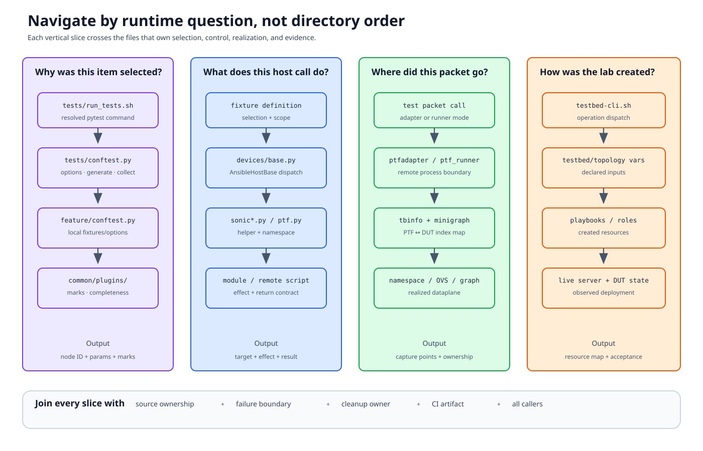

# A guided code tour

Read `sonic-mgmt` in vertical slices. Each slice should answer one runtime
question across selection, fixtures, remote objects, deployment, and evidence.
Reading every file in a large directory first hides those joins.



## Before opening code

Choose:

- one exact test node or small module;
- one selected topology/testbed;
- one concrete DUT/ASIC/PTF interface; and
- one question such as “why was it skipped?” or “how did this packet reach
  Ethernet8?”

Use `rg` to find definitions and all callers. Generated API documentation is
a discovery aid; current code supplies the contract.

## Slice 1: from command to collected item

Start with:

1. `tests/run_tests.sh` — how user-facing options become pytest arguments;
2. `tests/conftest.py::pytest_addoption` — shared options;
3. the target module and nearest `conftest.py` — local options/fixtures;
4. `tests/conftest.py::pytest_generate_tests` — DUT/ASIC enumeration;
5. topology/custom/conditional/completeness plugins — final collection policy.

Useful searches:

```console
rg -n "pytestmark|mark\.topology|def test_" tests/<feature>
rg -n "def pytest_generate_tests|def pytest_collection" tests
rg -n "addoption\(" tests/<feature> tests/conftest.py
```

Checkpoint: write the final node ID, parameter values, topology match, and
every possible skip/xfail source.

## Slice 2: from testbed name to host objects

Follow:

1. `tests/conftest.py::get_tbinfo` and `tbinfo`;
2. `tests/common/testbed.py::TestbedInfo`;
3. the selected testbed YAML entry;
4. its `ansible/vars/topo_<name>.yml`;
5. active inventory and connection graph;
6. `duthosts`, `ptfhosts`, `nbrhosts`, and `fanouthosts` fixture
   construction.

Do not stop at “the fixture returns a SonicHost.” Record which names and
inventory variables were used to construct it.

Checkpoint: produce a table with logical role, concrete hostname, object type,
management endpoint, and cardinality.

## Slice 3: from Python method to remote effect

Read:

1. the helper method called by the test;
2. `tests/common/devices/base.py::AnsibleHostBase.__getattr__` and `_run`;
3. the relevant `SonicHost`, `SonicAsic`, `PTFHost`, neighbor, or fanout
   wrapper;
4. any custom Ansible module or remote script; and
5. the returned dictionary/fact contract.

For multi-ASIC behavior, follow `multi_asic.py` and `sonic_asic.py`.
Determine whether the helper operates globally, in one namespace, or fans out
across ASICs.

Checkpoint: describe input validation, remote command/module, namespace,
return shape, error behavior, and side effects.

## Slice 4: from packet object to DUT port

Choose the mode:

### Adapter path

```text
testutils.send/verify
  -> tests/common/plugins/ptfadapter
  -> PtfAgent / ptf_nn_agent
  -> PTF ethN
```

### Remote test path

```text
ptf_runner
  -> remote PTF executable
  -> test under ansible/roles/test/files/ptftests
  -> PTF ethN
```

Then follow:

```text
PTF index
  -> ifaces_map / owning PTF host
  -> direct VLAN or veth/OVS injected link
  -> server trunk/fanout or virtual bridge
  -> live minigraph DUT interface
  -> ASIC namespace
```

Checkpoint: identify where to capture at every boundary and which artifact is
collected on failure.

## Slice 5: fixture ownership and cleanup

For each explicit and auto-used fixture:

- scope;
- dependencies;
- first remote mutation;
- original-state capture;
- value yielded;
- teardown/finalizer;
- behavior after partial setup failure; and
- interaction with log analyzer and sanity.

Search:

```console
rg -n "@pytest\.fixture|yield|addfinalizer|autouse=True" tests/<feature>
```

Checkpoint: make a mutation ledger. Every row must have a restoration owner.

## Slice 6: deployment is a separate lifecycle

Only after understanding what pytest expects, follow:

1. `ansible/testbed-cli.sh`;
2. the selected operation such as `add-topo`, `deploy-mg`, or
   `remove-topo`;
3. called playbooks;
4. roles/templates for VM/container/PTF/OVS/fanout/DUT configuration; and
5. generated or deployed state.

Search the operation string in `testbed-cli.sh`, then follow variables into
roles. Do not infer current behavior only from a command name.

Checkpoint: separate declared input, created resources, DUT configuration, and
acceptance evidence.

## Worked vertical slice: ARP unicast reply

The [annotated ARP chapter](annotated-test.md) demonstrates the complete path:

```text
test_arpall.py marker
  -> DUT/ASIC parameterization
  -> arp/conftest.py interface selection
  -> extended minigraph PTF index
  -> ptf_runner
  -> remote arptest.py
  -> DUT ASIC ARP-table facts
  -> fixture restoration + config reload
  -> log/sanity outcome
```

Use that pattern on a second, smaller feature. If you cannot identify one
equivalent boundary, that is the next code to read.

## Review a shared change

For a fixture/plugin/helper edit:

1. record current implementation and fixture scope;
2. find every caller and indirect plugin registration;
3. group callers by topology, DUT/ASIC cardinality, and execution mode;
4. check setup, teardown, parallel, and missing-resource paths;
5. inspect schemas/test plans/docs that define intent;
6. run focused unit/collection tests when available;
7. collect one real or mocked end-to-end contract test; and
8. update the owning documentation.

Root `conftest.py`, auto-used plugins, host wrappers, and deployment roles
have repository-wide blast radius. Review them as framework changes.

## When to stop reading

A slice is complete when you can answer:

- who selected the object;
- which source owns each value;
- which remote boundary the operation crosses;
- what observable proves success;
- who restores state; and
- which artifact survives CI.

Then move to a different slice instead of continuing linearly through the
directory.
