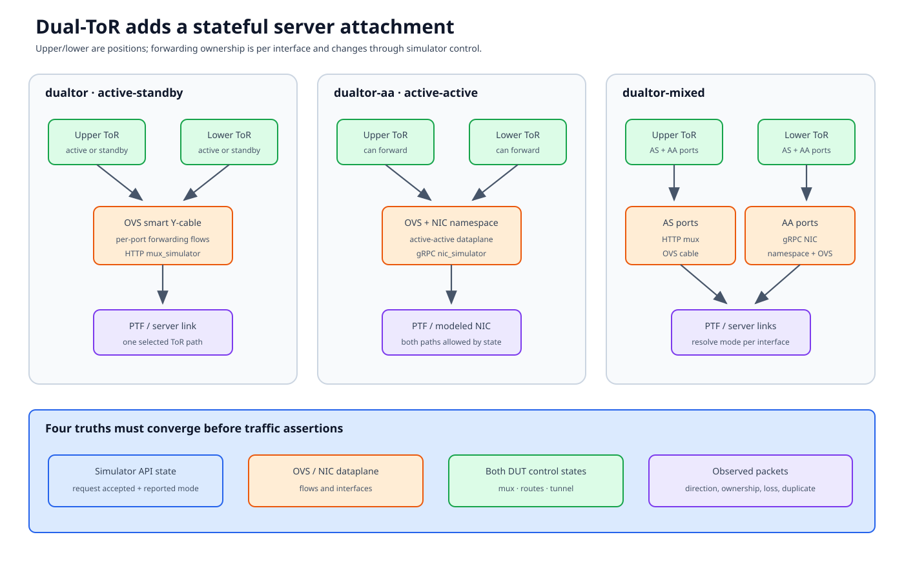

# Dual-ToR and mux simulation

Dual-ToR topologies add a second ToR and a stateful server-facing attachment.
“Upper” and “lower” are stable testbed positions; active, standby, and
forwarding ownership can change per interface during a test.



## Documentation basis

| Source | Contribution |
|---|---|
| [Dual-ToR testbed setup][dualtor-setup] | Active-standby, active-active, mixed topology architecture and deployment |
| [Mux port setup][mux-ports] | Simulator port assignment and setup details |
| `tests/dualtor/conftest.py` | Test-local fixtures, responders, and topology setup |
| `tests/common/dualtor/` | Mux/NIC simulator clients, state toggles, traffic, tunnel, failure, and recovery helpers |
| `ansible/group_vars/all/mux_simulator_http_port_map.yml` | Testbed-to-HTTP mux simulator port mapping |
| `ansible/group_vars/all/nic_simulator_grpc_port_map.yml` | Testbed-to-gRPC NIC simulator port mapping |

## Three topology families

### `dualtor`: active-standby smart cable

The active-standby topology models a server NIC connected through a smart
Y-cable to both ToRs. In the virtual realization, OVS represents the cable
dataplane. `mux_simulator` exposes an HTTP control API that changes OVS flow
state.

For one server link, traffic normally forwards through the active ToR path.
The standby ToR can receive tunneled traffic or take ownership after a
transition, according to feature state.

### `dualtor-aa`: active-active NIC

The active-active topology models a NIC that can use both ToRs.
Network namespaces and OVS realize NIC dataplane endpoints, while
`nic_simulator` provides a gRPC-facing NIC control model. Deployment uses
`netns_mgmt_ip` for management of these simulated NIC namespaces.

Both ToRs may legitimately forward, so active-standby assertions do not carry
over unchanged.

### `dualtor-mixed`

The mixed topology contains both port types. It needs both simulator services,
both port maps, and test selection that knows which interface type is under
test.

Never infer behavior from the family name alone; resolve the selected port's
mux/NIC mode.

## Four truths must converge

A reliable assertion compares:

1. **simulator control state** — HTTP/gRPC view of the modeled cable/NIC;
2. **OVS dataplane state** — flows and interfaces that implement that view;
3. **DUT control state** — mux status, routes, neighbors, tunnel/endpoints; and
4. **observed packets** — which ToR/path actually carried traffic.

API success proves only that a request was accepted. DUT state can converge
before OVS traffic reflects it, or OVS can forward while the DUT reports stale
state. Poll each required observation with a deadline.

## Identity and roles

Keep:

```text
(upper/lower role, DUT hostname, ASIC namespace,
 server/mux interface, PTF index, simulator endpoint)
```

Upper/lower order comes from the selected testbed/fixture contract. Do not use
`duthosts[0]` as an undocumented upper-ToR rule.

Mux state is per interface. “The upper ToR is active” can be false for another
server link in the same run.

## Reliable scenario structure

### Baseline

- select both ToRs and explicit mux/NIC interfaces;
- record original simulator, OVS, and DUT states;
- start/responders and clear stale packets;
- verify baseline upstream and downstream forwarding; and
- record tunnel path if the scenario depends on it.

### One transition

Inject one cause:

- explicit mux toggle;
- ToR/link/server failure;
- service/process disruption;
- route/neighbor change; or
- active-active NIC state change.

Use the shared helper matching the scenario; it usually encodes simulator and
recovery behavior that direct OVS manipulation would bypass.

### Convergence

Wait for all expected states, not just elapsed time:

- simulator response;
- DUT mux/control state on both ToRs;
- route/neighbor/tunnel readiness;
- OVS/NIC simulator state where observable; and
- stable traffic ownership.

### Traffic assertions

Separate directions:

- server/downstream to network/upstream;
- upstream to server/downstream;
- ToR-to-ToR tunnel path;
- duplication/drop constraints for active-active; and
- loss during transition versus steady-state forwarding.

Flush stale packets between phases so pre-transition frames do not satisfy a
post-transition check.

### Restoration

Restore the recorded state even after partial transition. Prove simulator,
DUT, and dataplane convergence again and stop responders/background traffic.

## Simulator endpoint mapping

The testbed name selects service ports from the HTTP/gRPC port-map files. A
service can be healthy on the server yet unreachable because the selected
testbed maps to the wrong port.

When an API fails, check in order:

1. selected `conf-name`;
2. expected map entry;
3. server management address and firewall;
4. service/container/process;
5. endpoint health/listening port; and
6. client request/response.

Do not debug DUT mux state until the simulator endpoint is proven.

## Failure boundaries

| Symptom | First boundary |
|---|---|
| HTTP/gRPC unreachable | Port map, management address, simulator service |
| Upper/lower roles swapped | Testbed ordering/role fixture |
| API state changes, DUT does not | DUT control-plane reconciliation |
| DUT changes, packets stay on old path | OVS flow/NIC dataplane realization |
| Upstream works, downstream fails | Mux ownership, responder, tunnel/neighbor state |
| Intermittent duplicates/loss | Convergence window, stale packets, active-active contract |
| Following module fails | Mux/NIC state, responders, or failure injection not restored |

## Review checklist

- Does the test support AS, AA, mixed, or a precise subset?
- Is each selected interface's mode explicit?
- Are upper/lower roles derived, not positional?
- Are simulator, DUT, and dataplane states all observed?
- Is transition loss measured separately from steady-state?
- Is original per-interface state restored on every failure path?

[dualtor-setup]: https://github.com/sonic-net/sonic-mgmt/blob/master/docs/testbed/README.testbed.DualtorSetup.md
[mux-ports]: https://github.com/sonic-net/sonic-mgmt/blob/master/docs/tests/setup.dualtor.mux.ports.md
