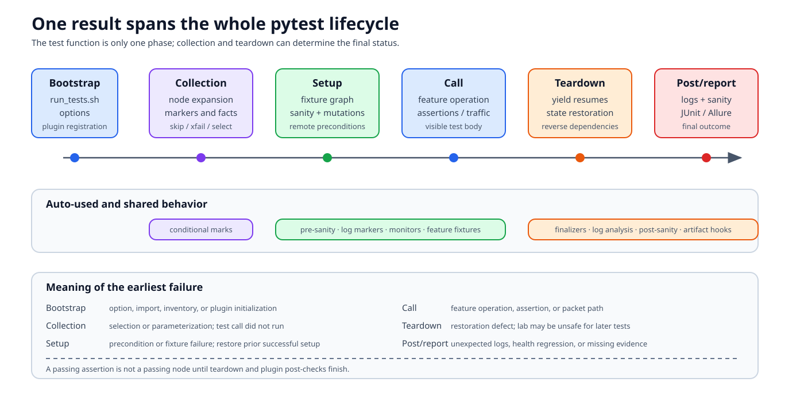

# The pytest execution lifecycle

A `sonic-mgmt` result is produced by more than the test function. Collection
plugins may skip it, fixtures may change several remote systems before it
starts, auto-used plugins may inspect logs after it returns, and teardown may
fail while restoring the lab. The useful unit of reasoning is the entire
pytest lifecycle.



## Documentation basis

| Source | What it establishes |
|---|---|
| [Pytest test overview][pytest-overview] | Repository test organization and common fixtures |
| [Running pytest tests][pytest-run] | Supported wrapper, options, direct pytest invocation, logging, and examples |
| [Writing tests][writing-tests] | Test structure, fixture use, topology markers, and cleanup expectations |
| `tests/run_tests.sh` | The current wrapper and command construction |
| `tests/conftest.py` | Current shared plugins, selection hooks, fixtures, and parameter generation |
| `tests/common/plugins/` | Collection, setup, call, teardown, and report behavior added around tests |

## Before pytest starts

`tests/run_tests.sh` is the supported convenience entry point. It validates
and translates selections such as DUT, inventory, testbed, and test case into
a pytest command. It also establishes repository-specific defaults.

A representative narrow invocation is:

```console
cd tests
./run_tests.sh -d <dut> -n <testbed> -i <inventory> \
  -u -e "--testbed_file <testbed-file>" \
  -c "arp/test_arpall.py::test_arp_unicast_reply"
```

Always check `./run_tests.sh --help` and [the run guide][pytest-run] on the
branch being tested. Site wrappers may add another layer.

Direct pytest invocation is useful for development, but argument ordering
matters: options declared by a directory-local `conftest.py` are available
only after pytest discovers that test path. A command rejected as an
“unrecognized argument” may be a bootstrap/order problem rather than a removed
feature.

## Phase 1: startup and plugin registration

Pytest loads root and directory-local `conftest.py` files. The current root
configuration registers plugins covering:

- host and Ansible fixtures;
- topology and custom markers;
- conditional marks and completeness levels;
- PTF adapter access;
- pre/post sanity and recovery;
- log analysis and log-section boundaries;
- dual-ToR, platform API, decap, and shared feature fixtures;
- random seeds, memory/process monitoring, and parallel fixtures; and
- Allure/reporting integration.

The exact list changes. The architectural point is that these plugins are part
of every matching test's behavior even when the test module never imports
them.

Startup also parses testbed/inventory options and initializes session-level
objects. A failure here can occur before collection has produced a test item.

## Phase 2: collection and parameter generation

Pytest imports test modules, identifies test functions/classes, and creates
items. `sonic-mgmt` then expands some fixtures into DUT, ASIC, or role
parameters. A single source function may therefore produce multiple node IDs.

Collection-time filters include:

- `pytest.mark.topology(...)` compatibility;
- custom DUT/ASIC enumeration fixtures;
- conditional skip/xfail/mark files;
- completeness-level selection; and
- ordinary pytest selectors such as node ID, `-k`, and markers.

Collection answers “which cases are candidates?” It does not verify that the
dataplane is healthy. Use `--collect-only` when the problem is node
expansion or selection, and inspect the final markers attached to an item.

## Phase 3: fixture setup

Before the test call, pytest resolves the fixture dependency graph. Broader
scopes are normally created before narrower scopes:

| Scope | Typical use | Lifetime |
|---|---|---|
| Session | Parsed testbed, inventories, host collections | Whole pytest process |
| Module | Expensive topology state, PTF agents, pre/post sanity | One test module |
| Class | State shared by tests in a class | One class |
| Function | Per-case mutations and data | One test item |

The graph, not the parameter order, determines setup order. Auto-used fixtures
join the graph without appearing in the function signature.

Setup may:

- construct remote host wrappers;
- run pre-test sanity checks and recovery;
- copy PTF tests or configuration;
- modify DUT interfaces, routes, services, or polling intervals;
- configure neighbors, fanouts, muxes, or traffic generators; and
- place log-analysis markers.

If a setup fixture fails, the test function does not run. Fixtures that
already yielded or registered finalizers still need teardown.

## Phase 4: test call

Only now does the Python test body execute. It should make the feature-specific
operation and assertion easy to identify. Remote methods can hide substantial
work:

```python
result = duthost.shell("show interface status")
```

This is a local Python call through a host wrapper, an Ansible module
invocation, a remote command, result serialization, and local assertion/log
processing. Packet calls add a PTF control and dataplane boundary.

The call can be marked passed, failed, skipped, or xfailed, but that status is
not necessarily the final node result.

## Phase 5: teardown and post-test checks

Yield fixtures resume in reverse dependency order. They must restore every
mutated system, including partial-setup paths. Common restoration includes:

- re-adding port-channel members or addresses;
- restoring services, images, config, or polling intervals;
- removing temporary files, routes, ACLs, or traffic streams;
- stopping background monitors; and
- performing a safe config reload when local rollback is insufficient.

Auto-used log analyzers inspect the bounded log interval and can fail a test
whose feature assertion passed. Sanity checks can run after a module and
attempt recovery. Teardown failures are first-class failures because a dirty
testbed makes later results unreliable.

## Phase 6: report and artifact generation

Pytest and plugins emit console/file logs, JUnit or Allure results, captures,
remote command evidence, and topology/platform metadata. CI may then package
or upload them.

Separate three questions:

1. What did the test body report?
2. Did setup/teardown/plugins change the final outcome?
3. Did reporting preserve enough evidence to diagnose it?

[CI and reporting](ci-and-reporting.md) covers the third pipeline.

## One item can have several outcomes

| Situation | Final interpretation |
|---|---|
| Collection excludes item | Not executed; inspect selection and markers |
| Setup fails | Environment/precondition failure; call never ran |
| Call fails, teardown passes | Feature assertion or operation failure |
| Call passes, log analysis fails | Unexpected DUT logs during the test interval |
| Call passes, teardown fails | Restoration defect or unhealthy lab |
| Call xfails for matching reason | Expected failure, subject to strictness |
| Recovery succeeds after failed sanity | The run may continue, but recovery evidence still matters |

Do not report “the test passed” from a single assertion log line.

## Parallelism changes ownership

Pytest-xdist and topology-specific parallel fixtures can execute work in
separate workers or coordinate a shared environment. This affects:

- which worker owns a session/module fixture;
- whether a mutation is safe across tests;
- where logs are written;
- whether recovery must be serialized; and
- whether selection generates duplicate pressure on one DUT/ASIC.

Never use process-global state as a lab lock. Follow the existing parallel
fixture and topology mechanisms for the suite.

## Debugging by the earliest failed phase

| Evidence | Start here |
|---|---|
| Option rejected | Wrapper/direct-pytest bootstrap and local `conftest.py` |
| Zero items or unexpected skip | Collection, topology marker, conditional marks |
| Fixture not found | Import path and conftest/plugin registration |
| Setup error | First failing fixture and its already-created dependencies |
| Assertion/PTF error | Test call and feature evidence |
| Passed assertion but failed node | Log analyzer, finalizers, post-sanity |
| Next module fails after this one | Previous teardown and recovery |

For one node, write a small timeline: collection decision, setup fixtures,
first remote mutation, call, each restoration, post-check, artifact location.
That timeline is more useful than a flat stack trace.

Next, [Fixtures and device objects](fixtures-and-hosts.md) explains the objects
that populate the setup graph.

[pytest-overview]: https://github.com/sonic-net/sonic-mgmt/blob/master/docs/tests/README.md
[pytest-run]: https://github.com/sonic-net/sonic-mgmt/blob/master/docs/tests/pytest.run.md
[writing-tests]: https://github.com/sonic-net/sonic-mgmt/blob/master/docs/tests/writing.tests.help.md
