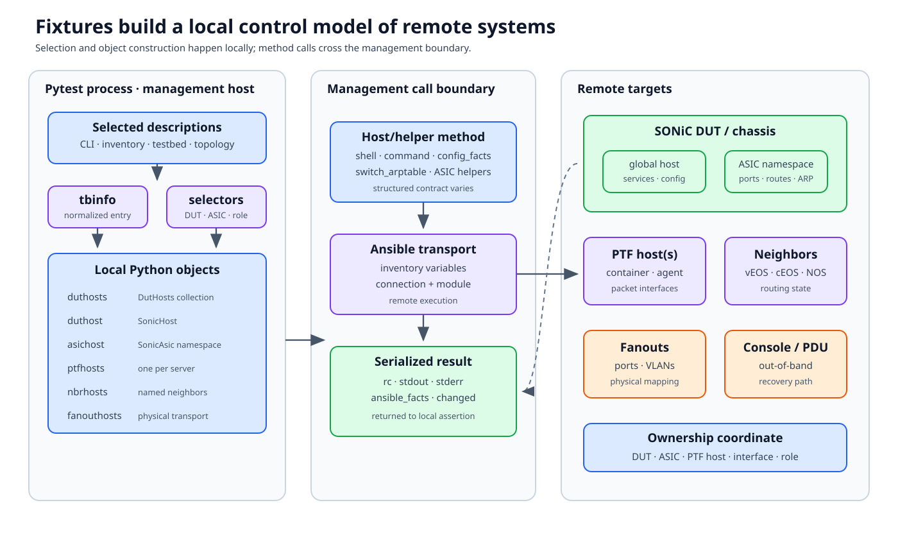

# Fixtures and device objects

Tests run locally in pytest, but most operations happen on remote DUTs,
servers, PTF containers, neighbors, and fanouts. Fixtures build the control
model that connects those worlds.



## Documentation basis

| Source | Contribution |
|---|---|
| [Pytest overview][pytest-overview] and [writing guide][writing-tests] | Shared fixture vocabulary and test-author expectations |
| [Fixture API wiki][api-wiki] | Searchable reference for fixtures and host methods |
| `tests/conftest.py` | Current fixture construction and DUT/ASIC parameter generation |
| `tests/common/devices/base.py` | Dynamic Ansible module dispatch in `AnsibleHostBase` |
| `tests/common/devices/duthosts.py` | Multi-DUT aggregation and role subsets |
| `tests/common/devices/multi_asic.py` and `sonic_asic.py` | DUT-to-ASIC selection and namespace behavior |

The generated API wiki can lag current code or contain incomplete entries.
Use it to discover names, then verify scope, return type, and side effects in
the implementation.

## Fixtures form a dependency graph

In:

```python
def test_example(duthosts, rand_one_dut_hostname, tbinfo):
    duthost = duthosts[rand_one_dut_hostname]
```

`duthosts` depends on parsed testbed and inventory state.
`rand_one_dut_hostname` depends on the selected DUT set and parameterization
rules. `tbinfo` depends on command-line testbed selection. Pytest resolves
that graph and caches values according to fixture scope.

The function signature is therefore an interface declaration, not the setup
sequence. Read each fixture's scope and dependencies.

## Local proxies, remote effects

`AnsibleHostBase` turns unknown attributes into Ansible module calls. A call
such as:

```python
status = duthost.shell("show interface status")
```

crosses several boundaries:

```text
test function
  -> SonicHost / SonicAsic method or dynamic Ansible module
  -> Ansible connection and inventory variables
  -> remote process or SONiC namespace
  -> serialized result dictionary
  -> local Python assertion
```

This has practical consequences:

- a Python exception may represent management transport, module, shell, or DUT
  command failure;
- the result commonly contains `rc`, `stdout`, `stderr`, and
  `ansible_facts`, but contracts vary by helper;
- `module_ignore_errors=True` changes exception behavior, not remote
  correctness; and
- command logging may reveal the caller and remote result even when the
  top-level test is terse.

Read the actual helper contract before assuming a method is read-only,
namespace-aware, retrying, or safe for arbitrary input.

## Core selection fixtures

### `tbinfo`

`tbinfo` is the normalized selected testbed entry. It carries topology name
and type, DUT names, server/PTF information, and topology properties needed by
other fixtures. It describes the selected environment; it is not a live
health report.

### `duthosts`

`duthosts` is a `DutHosts` collection built from selected DUT names. It
provides:

- `nodes`: all selected nodes;
- `frontend_nodes`: forwarding nodes;
- `supervisor_nodes`: supervisors in chassis systems; and
- collection methods that can invoke an operation across hosts and return a
  hostname-keyed result.

Do not silently use the first DUT when topology roles matter.

Hostname selectors such as `rand_one_dut_hostname`,
`enum_rand_one_per_hwsku_frontend_hostname`, or role-specific fixtures make
selection explicit. Randomized fixtures normally use the session seed so a
failure can be reproduced.

### DUT plus ASIC

On a multi-ASIC DUT, the remote coordinate is:

```text
(DUT hostname, ASIC index/namespace)
```

`duthost.asic_instance(index)` returns a `SonicAsic` view. Its helpers add
the correct namespace option where required. The default ASIC may have no
namespace string; that is not equivalent to “all ASICs.”

Use an ASIC enumeration fixture when the test is ASIC-local. Use the DUT host
when the operation is chassis/global. Mixing those levels is a common reason
that tests pass on a single-ASIC platform and read the wrong state on a
multi-ASIC platform.

### `ptfhosts` and `ptfhost`

`ptfhosts` can create one PTF host per participating server. It can be empty
for topologies that intentionally have no PTF host or use a traffic-generator
API instead.

`ptfhost` returns the first PTF host for backward compatibility. That is
appropriate only when the topology and interface map fit on one server.
Distributed tests should keep PTF-host ownership with each port.

### `nbrhosts`

`nbrhosts` maps logical neighbor names to host objects and metadata. It is
empty when the topology has no VMs. Neighbor implementation may be vEOS,
cEOS, another NOS, or a topology-specific container; test against required
capabilities instead of assuming one backend.

### `fanouthosts`

`fanouthosts` is derived from connection-graph data, inventory, and
credentials. These objects operate the physical transport layer—ports and
VLANs—not logical routing neighbors.

## Fixture scope is an ownership contract

A fixture that mutates remote state owns restoration for its scope.

```python
@pytest.fixture(scope="module")
def configured_feature(duthost):
    original = read_state(duthost)
    apply_state(duthost)
    try:
        yield
    finally:
        restore_state(duthost, original)
```

The `finally` matters when setup after the first mutation raises or when the
test is interrupted. Prefer restoring the observed original state over writing
a guessed default.

Broader scope reduces setup time but increases blast radius:

- a module fixture can contaminate every test in the module;
- a session fixture affects the entire worker;
- a shared physical resource may outlive a worker's fixture cache; and
- random selection at broad scope can hide per-DUT differences.

Choose scope from state ownership, not convenience.

## Auto-used fixtures are invisible dependencies

Directory `conftest.py` files and plugins can declare `autouse=True`.
Examples include log boundaries, sanity wrappers, monitors, and module setup.
When reviewing a test, inspect:

1. its explicit parameters;
2. module/class `pytestmark`;
3. the nearest `conftest.py`;
4. parent conftests up to `tests/conftest.py`; and
5. registered plugins.

This reveals setup and cleanup that the function signature cannot show.

## Parameterization and cardinality

A selector may expand a test across:

- every selected DUT;
- one DUT per hardware SKU;
- every frontend ASIC;
- a random frontend node;
- supervisor/frontend roles; or
- topology-defined enumerations.

Record the final node ID and parameter values in failures. “The test failed on
the chassis” is less useful than “it failed on DUT X, frontend ASIC 2, PTF host
Y, seed Z.”

## Safe host-object use

- Prefer structured helper/module arguments over shell-string construction.
- Check return codes and expected fact keys; do not use stdout presence as a
  universal success signal.
- Pass `tbinfo` to helpers that need topology-aware mapping.
- Keep the DUT/ASIC coordinate attached to interface and route data.
- Avoid storing remote objects in module globals.
- Do not assume `ptfhost` exists or that `nbrhosts` is non-empty.
- Make cleanup idempotent and safe after partial setup.

## Debug a fixture failure

| Failure | Inspect |
|---|---|
| Fixture not found | Test path, local conftest discovery, plugin registration |
| Host name missing | Selected testbed entry and inventory |
| Dynamic module attribute fails | Host connection, module name/arguments, remote result |
| Wrong DUT chosen | Parameterization fixture and role subset |
| State absent on multi-ASIC | `SonicHost` versus `SonicAsic`, namespace option |
| PTF port missing | Owning `ptfhost(s)`, interface map, deployed namespace |
| Later test starts dirty | Yield/finalizer path and original-state capture |

[Packet tests and PTF](packet-tests.md) uses these objects to cross the
management-to-dataplane boundary.

[pytest-overview]: https://github.com/sonic-net/sonic-mgmt/blob/master/docs/tests/README.md
[writing-tests]: https://github.com/sonic-net/sonic-mgmt/blob/master/docs/tests/writing.tests.help.md
[api-wiki]: https://github.com/sonic-net/sonic-mgmt/tree/master/docs/api_wiki
