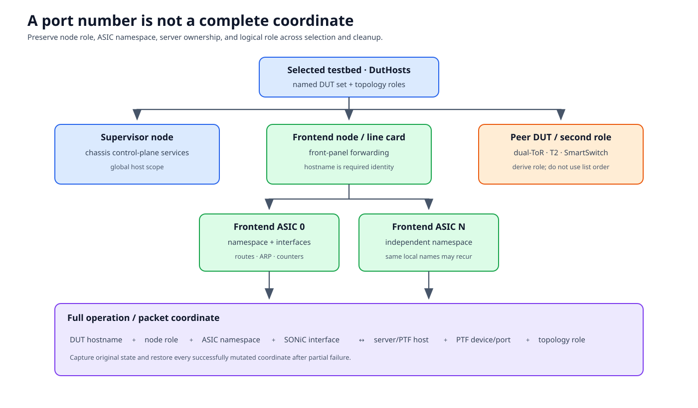

# Multi-DUT and multi-ASIC tests

Multi-DUT and multi-ASIC are independent dimensions. A testbed can contain
several physical or virtual DUTs; each DUT can expose one or more ASIC
namespaces. Chassis systems add node roles, and distributed testbeds add
test-server/PTF ownership.



## Documentation basis

| Source | Contribution |
|---|---|
| [VOQ chassis pytest guide][voq-guide] | Chassis roles, topology expectations, and test guidance |
| [Multiple-server deployment][multi-server] | Distributed server/PTF placement |
| `tests/common/devices/duthosts.py` | `DutHosts`, frontend/supervisor subsets, fan-out methods |
| `tests/common/devices/multi_asic.py` | Multi-ASIC host behavior and ASIC classification |
| `tests/common/devices/sonic_asic.py` | Namespace-aware ASIC operations |
| `tests/conftest.py::pytest_generate_tests` | Current DUT/ASIC enumeration fixtures |
| [Fixture API wiki][api-wiki] | Discoverable fixture/helper reference |

## Three hierarchies

### Testbed hierarchy

```text
selected testbed
  ├─ DUT 1
  ├─ DUT 2
  ├─ ...
  └─ topology roles and links
```

T2, dual-ToR, chassis, and SmartSwitch topologies use multiple DUT names for
different purposes. Ordering is not a substitute for role.

### Chassis/node hierarchy

```text
DutHosts
  ├─ frontend_nodes      forwarding line cards / nodes
  ├─ supervisor_nodes    chassis control-plane nodes
  └─ nodes               all selected nodes
```

A test of front-panel forwarding usually selects frontend nodes. A chassis
service test may intentionally select supervisors. Fabric/control-plane tests
can require coordinated observations from both.

### ASIC hierarchy

```text
one SonicHost / multi-ASIC DUT
  ├─ frontend ASICs      front-panel/network-facing
  └─ backend ASICs       internal/fabric-facing
```

`duthost.asic_instance(index)` returns a `SonicAsic` control object. The
default ASIC can use the global/default namespace representation; do not treat
an empty namespace option as “operate on all ASICs.”

## The complete coordinate

For an interface, route, DB entry, counter, or packet path, preserve:

```text
(DUT hostname, node role, ASIC index/namespace, interface,
 owning test server/PTF host, PTF device/port, topology role)
```

Not every operation needs every field, but dropping a necessary dimension
creates ambiguity. “Ethernet0 failed on ASIC 0” is incomplete if three line
cards each have ASIC 0.

## Select through fixtures

Select a concrete host through a repository fixture:

```python
def test_example(duthosts, enum_rand_one_per_hwsku_frontend_hostname):
    duthost = duthosts[enum_rand_one_per_hwsku_frontend_hostname]
```

Common selector families express different contracts:

- enumerate every selected DUT;
- choose one DUT randomly;
- choose one frontend DUT per HWSKU;
- select supervisor or frontend roles;
- enumerate frontend ASICs; or
- enumerate all or specific DUT/ASIC combinations.

Use the narrowest fixture whose contract matches the test. A local
`random.choice(duthosts)` bypasses role/HWSKU rules and makes seed reporting
harder. `duthosts[0]` encodes accidental order.

## Global versus ASIC-local operations

Use the global `SonicHost` for operations that own the entire node, such as
some config reloads, image/service management, platform facts, and chassis
control. Use `SonicAsic` for namespace-local routes, neighbors, interfaces,
and per-ASIC services/DBs.

| Operation question | Likely scope |
|---|---|
| Which image is booted on this node? | Global host |
| Is BGP healthy in this network namespace? | ASIC |
| Reload node configuration | Global, coordinated with all ASICs |
| Read front-panel port counters | Owning frontend ASIC |
| Check chassis supervisor service | Supervisor/global |
| Check fabric reachability | Backend ASIC and peer coordinates |

Read the helper implementation. Some multi-ASIC host methods dispatch to one
or all ASICs and return hostname/namespace-keyed data; others operate only
globally.

Prefer namespace-aware helpers to hand-built
`ip netns exec <namespace> ...`. Helpers handle default namespace and return
contracts more consistently.

## Multi-DUT coordination

A distributed test can have a leader, peers, or symmetric roles. Make the role
mapping explicit at setup:

```python
role_to_dut = {
    "upper_tor": ...,
    "lower_tor": ...,
}
```

Do not rely on list position to assign semantic roles. Derive roles from
topology/testbed data or established role fixtures.

For each mutation:

1. identify every affected DUT/ASIC;
2. capture original state independently;
3. apply in an order that keeps the topology recoverable;
4. wait on observed convergence, not only command return; and
5. restore all coordinates even if a middle step fails.

Use `try/finally`, yield fixtures, and idempotent rollback. A one-host
config reload is not automatically valid cleanup for a coordinated chassis
change.

## Multiple test servers and PTF hosts

Distributed testbeds can place DUT links on different servers. Deployment can
create one PTF container per server, with interface tuples that identify both
server/device and local port.

Consequences:

- `ptfhost` selects only the first PTF host for compatibility;
- a PTF integer is local to an owning device/host;
- copied PTF files and services may need deployment on every relevant host;
- captures/artifacts must include server identity; and
- packet verification may need coordination across agents.

Keep the DUT-to-server/PTF map in fixture data rather than reconstructing it
from hostname conventions.

## Aggregation without losing provenance

`DutHosts` helpers may fan an operation across nodes and return
hostname-keyed results. Preserve that key when comparing:

```python
results = duthosts.command("show version")
for hostname, result in results.items():
    ...
```

For per-ASIC data, preserve a nested key or structured record. Flattening
routes or ports across namespaces can turn two valid local identifiers into a
collision.

## Parallel execution and shared state

Parallel workers can target the same chassis, PTF host, or control service.
Before marking a suite parallel-safe, identify:

- shared global services and Config DB tables;
- module/session fixture scope per worker;
- topology-level locks/recovery coordination;
- PTF interface/traffic ownership;
- log marker overlap; and
- artifact filename collisions.

Per-ASIC isolation does not guarantee node-level isolation.

## Failure patterns

| Symptom | Likely category error |
|---|---|
| Passes on single ASIC, empty on chassis | Global command read only default namespace |
| One line card never runs | Selector chose one per HWSKU or wrong role |
| Supervisor receives dataplane command | First-DUT/list-order assumption |
| PTF verifies wrong link | Port number lost server/DUT ownership |
| Cleanup fixes one ASIC only | Original state or rollback was flattened |
| Aggregated assertion is nondeterministic | Hostname/namespace provenance discarded |
| Parallel modules interfere | Shared node/PTF service not coordinated |

## Review checklist

- Is DUT selection role-aware and visible in the node ID/log?
- Is every ASIC-local operation made through an ASIC-aware object?
- Are global operations intentionally global?
- Are PTF/server/interface coordinates preserved?
- Does cleanup cover every successfully mutated coordinate after partial
  failure?
- Are result dictionaries compared without losing hostname/namespace keys?
- Does the test state whether it supports supervisors, frontend nodes, backend
  ASICs, and multiple servers?

Specialized chapters reuse this coordinate model for dual-ToR and
SmartSwitch/DPU environments.

[voq-guide]: https://github.com/sonic-net/sonic-mgmt/blob/master/tests/docs/pytest.voq_chassis.md
[multi-server]: https://github.com/sonic-net/sonic-mgmt/blob/master/docs/testbed/README.testbed.DeployWithMultipleServers.md.md
[api-wiki]: https://github.com/sonic-net/sonic-mgmt/tree/master/docs/api_wiki
