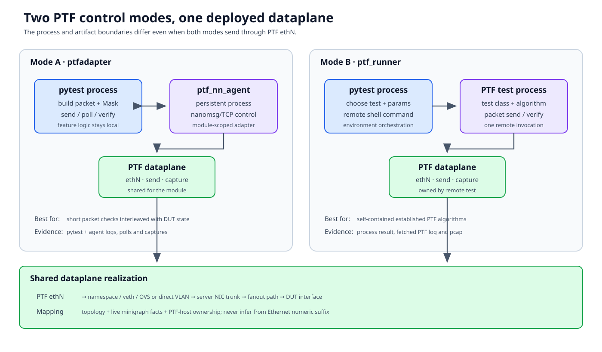

# Packet tests and PTF

`sonic-mgmt` uses PTF in two main ways. A pytest test can control a persistent
PTF dataplane through `ptfadapter`, or it can launch a complete PTF test
remotely through `ptf_runner`. They share interfaces but have different
process, logging, and cleanup boundaries.



## Documentation basis

| Source | Contribution |
|---|---|
| [PTF adapter README][ptfadapter-doc] | Agent topology, adapter fixture, packet construction and mask examples |
| [Testbed overview][testbed-overview] and [internals][testbed-internal] | Direct/injected PTF interfaces, namespaces, OVS, and VLAN realization |
| `tests/common/plugins/ptfadapter/__init__.py` | Current module-scoped adapter and multi-server agent construction |
| `tests/ptf_runner.py` | Current remote PTF command, Python-version selection, parameters, logs, pcaps, and artifacts |
| `ansible/roles/test/files/ptftests/` | Remote PTF test implementations |

## Mode 1: the persistent PTF adapter

The `ptfadapter` fixture creates a `PtfAgent` for each participating PTF
host and connects through nanomsg/TCP to `ptf_nn_agent` in the PTF
environment. The current fixture is module-scoped.

Pytest constructs and masks packets locally:

```python
pkt = testutils.simple_tcp_packet(
    eth_dst=router_mac,
    ip_dst=destination,
)

expected = Mask(pkt)
expected.set_do_not_care_scapy(Ether, "src")
expected.set_do_not_care_scapy(IP, "ttl")

testutils.send(ptfadapter, src_port, pkt)
testutils.verify_packet(ptfadapter, expected, dst_port)
```

The adapter serializes send, poll, and dataplane commands to the remote agent.
The agent owns the interfaces and packet capture. The Python packet object
never travels through the DUT management interface.

Use this mode when pytest owns the control logic and needs to interleave
device state with individual packet operations.

### Module scope matters

Because the adapter is shared for the module:

- flush stale packets before a check that assumes an empty queue;
- do not leave background traffic or filters active for the next test;
- keep device/port identity explicit in multi-server topologies; and
- treat agent restart or disconnect as a module-level infrastructure event.

## Mode 2: a remote PTF test

`ptf_runner(ptfhost, testdir, testname, ...)` assembles a PTF command and
executes it on the PTF host. The PTF test class constructs packets, runs its
own sequence, and returns a process result.

```python
ptf_runner(
    ptfhost,
    "ptftests",
    "arptest.VerifyUnicastARPReply",
    "/root/ptftests",
    params={
        "acs_mac": router_mac,
        "port": ptf_index,
    },
    log_file="/tmp/arp.log",
)
```

Current `ptf_runner`:

- locates the source test under the repository's PTF test directories;
- detects whether the PTF image is mixed-Python or Python-3-only;
- chooses the compatible PTF executable;
- serializes parameters for `-t`;
- runs the command on the remote host;
- fetches the PTF log and optional pcap; and
- attaches console/error evidence for reporting.

The pytest fixture or module must copy any required tests and data to the PTF
environment before execution.

Use this mode for established PTF suites with their own lifecycle or when the
packet algorithm is best isolated in the remote process.

## These modes are not interchangeable

| Concern | `ptfadapter` | `ptf_runner` |
|---|---|---|
| Packet logic lives in | pytest process | remote PTF test |
| Remote process | persistent `ptf_nn_agent` | one PTF command/test run |
| Fixture lifetime | module-scoped adapter | each helper invocation |
| Failure evidence | adapter logs/polls plus pytest logs | process result, PTF log, pcap |
| Best for | short, interleaved packet checks | self-contained packet algorithms |
| Cleanup owner | pytest test/fixture plus shared agent | remote test and invoking fixture |

## Port mapping: the critical translation

PTF APIs usually take a device/port tuple or an integer that refers to an
`ethN` interface inside a PTF environment. A DUT uses `EthernetN`, possibly
inside an ASIC namespace. The reliable translation comes from selected
topology and live minigraph/config facts:

```python
mg_facts = asichost.get_extended_minigraph_facts(tbinfo)
ptf_index = mg_facts["minigraph_ptf_indices"][dut_interface]
```

Then verify:

1. which PTF host owns that index;
2. how its `ifaces_map` names the local interface;
3. whether it is a direct or injected topology link;
4. which server VLAN/OVS/fanout path realizes it; and
5. which DUT/ASIC owns the SONiC interface.

Never infer `Ethernet8 -> PTF 2` from the numeric suffix. Breakout,
port-channels, multi-ASIC, and topology variants invalidate that shortcut.

## Build the expected packet deliberately

A packet assertion has three parts:

1. input packet and ingress port;
2. expected transformation and candidate egress ports; and
3. fields intentionally ignored.

Use a mask only for fields the DUT is allowed to change or the test does not
own. Over-masking can turn a forwarding defect into a pass. Under-masking
creates platform-sensitive failures for fields such as source MAC, TTL,
checksums, or padding.

Write down the forwarding contract before writing the mask:

| Field | Expected behavior |
|---|---|
| Destination/source MAC | Routed, bridged, or preserved according to path |
| TTL/hop limit | Usually decremented for routed forwarding |
| IP addresses and L4 ports | Preserved unless testing NAT/tunneling |
| VLAN tag | Added, removed, translated, or preserved by topology |
| Payload | Preserved unless feature explicitly transforms it |
| Padding/checksum | Platform/tool behavior must be understood |

## Negative checks and time

`verify_no_packet` and similar helpers prove only that no matching packet was
observed in the selected interval and ports. Choose timeouts based on the
feature, not a desire for fast tests. Flush or drain unrelated traffic first,
and make masks narrow enough that background packets do not match.

For asynchronous control-plane changes, separate convergence polling from the
packet observation window. A fixed sleep hides which condition was late.

## Capture at boundaries

When a packet is missing, capture progressively:

```text
pytest send/poll result
  -> PTF ethN or nn-agent evidence
  -> PTF namespace / OVS / server VLAN
  -> fanout path (physical lab)
  -> DUT ingress counters/capture
  -> DUT route/FDB/neighbor/ASIC state
  -> DUT egress
  -> expected PTF interface
```

The last boundary with evidence narrows the defect. A remote command returning
success only proves that the PTF process accepted the command, not that a
frame reached the DUT.

## Multi-server and topology-specific cautions

- Use `ptfhosts` when interfaces span servers; the compatibility
  `ptfhost` fixture chooses only the first host.
- An injected PTF port taps a neighbor link through OVS; it is not equivalent
  to a direct modeled server port.
- `ptp` and some traffic-generator API topologies intentionally have no PTF
  host.
- Dual-ToR and SmartSwitch environments insert mux/NIC or DPU services into
  the path.
- Direct SAI tests replace normal SONiC forwarding services with a SAI server;
  see [SAI and PTF testing](sai-ptf.md).

## Failure matrix

| Symptom | Likely boundary |
|---|---|
| Adapter cannot connect | PTF management address, agent process, TCP reachability |
| Remote PTF test file missing | Copy fixture, image path, selected test directory |
| Send succeeds, no DUT ingress | PTF index, namespace/OVS/VLAN/fanout realization |
| DUT forwards, verify misses | Expected PTF host/port, mask, timing |
| Only one topology variant fails | Link type or index mapping, not generic packet API |
| Test passes locally but pcap absent in CI | Artifact collection path or log-file option |

[End-to-end annotated test](annotated-test.md) now follows one remote PTF test
and its DUT assertions.

[ptfadapter-doc]: https://github.com/sonic-net/sonic-mgmt/blob/master/tests/common/plugins/ptfadapter/README.md
[testbed-overview]: https://github.com/sonic-net/sonic-mgmt/blob/master/docs/testbed/README.testbed.Overview.md
[testbed-internal]: https://github.com/sonic-net/sonic-mgmt/blob/master/docs/testbed/README.testbed.Internal.md
