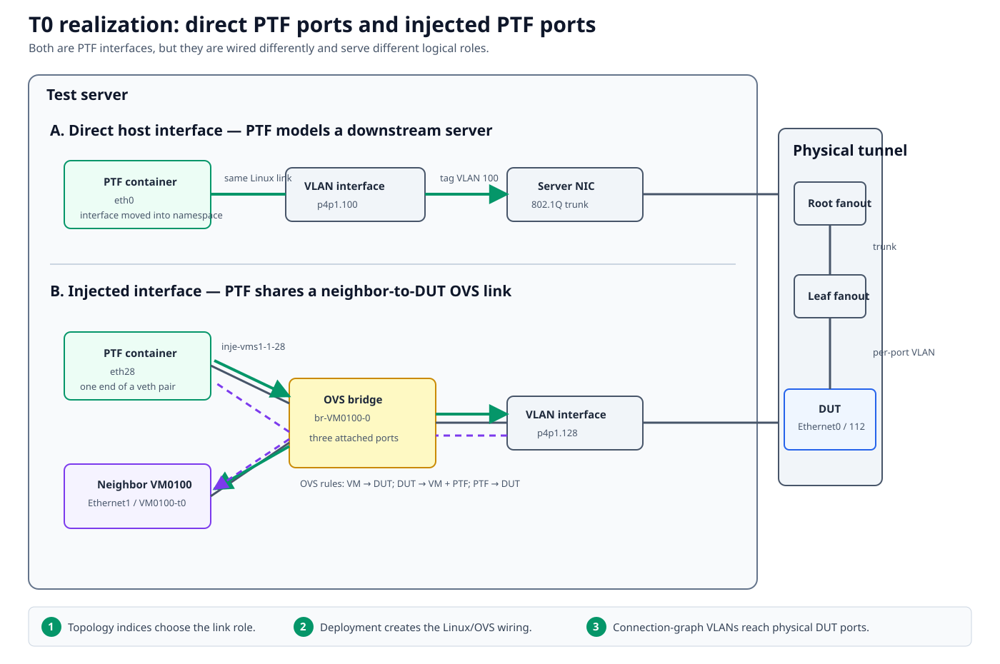

# Physical lab bring-up and operations

A physical lab is a maintained system, not a one-time deployment. It is ready
only when declared inventory/topology, installed cabling, management and
recovery access, fanout transport, server realization, and observed DUT state
agree.



## Documentation basis

| Source | Contribution |
|---|---|
| [Physical testbed setup][setup] | Required devices, server/fanout preparation, inventory and connection data |
| [Testbed overview][overview] | Canonical physical topology and VLAN tunnel model |
| [Fanout management][fanout] | Fanout credential and deployment behavior |
| [New testbed configuration][configuration] | YAML schemas, inventory groups, credentials, console/PDU/fanout definitions |
| [Minigraph deployment][minigraph] | Generating and applying DUT topology configuration |
| [Multiple servers][multi-server] | Distributed PTF and per-server interface placement |

These documents include site/platform assumptions, especially around Arista
fanout automation. Verify the playbook's supported fanout OS and credential
contract before applying it to a different platform.

## Design record before automation

Create an access-controlled source of truth containing:

- device name, role, platform, serial, management address, and rack position;
- test-server NICs, trunks, management bridge, and external ports;
- every DUT-to-fanout and fanout-to-server connection;
- console server line and PDU outlet per recoverable device;
- root/leaf fanout hierarchy and VLAN allocation;
- testbed entries, topology variants, DUT/server/PTF/VM bindings;
- credential-group ownership without committing secrets; and
- reservation, baseline image/config, and recovery policy.

Cable labels should map to connection-graph endpoint names. A spreadsheet that
uses unrelated aliases forces humans to perform an unrecorded translation
during every incident.

## The physical dataplane contract

One typical DUT-facing path is:

```text
PTF ethN
  -> direct VLAN interface or injected OVS bridge
  -> test-server NIC 802.1Q trunk
  -> optional root fanout
  -> leaf fanout VLAN-to-port mapping
  -> front-panel cable
  -> DUT interface
```

Each DUT link normally has a unique transport VLAN through the server/fanout
plant. This VLAN is lab plumbing, not necessarily the VLAN configured inside
SONiC for the modeled network.

For an injected neighbor link, PTF and the neighbor share an OVS bridge with
the DUT-facing VLAN. For a direct host link, PTF owns the interface without a
routed neighbor endpoint.

## Bring-up gates

### 1. Out-of-band recovery

Before normal SSH:

- verify each console line opens the intended device;
- verify PDU status and outlet mapping without cycling power;
- document bootloader/image-recovery steps; and
- test who is authorized to perform disruptive recovery.

Do not discover a swapped PDU outlet during a failed upgrade.

### 2. Independent management access

Reach DUTs, server, fanouts, neighbors, console, and PDU independently from the
management environment. Confirm DNS/inventory names, routes, credentials,
host keys, and connection types.

**Gate evidence:** a host-by-host read-only command record. Failure here is not
a topology problem.

### 3. Inventory and physical graph

Create inventory/group variables and the connection graph. Walk every DUT
front-panel cable and compare both endpoints to labels. Check breakout,
speed/FEC expectations, and port naming for the platform.

Use connection-graph facts to query the declared map, but remember that a
successful parse does not prove the cable.

**Gate evidence:** declared graph plus signed/dated cable audit.

### 4. Test-server foundation

Prepare the management bridge (commonly `br1` in documented setups), external
trunk NICs, Docker/KVM/OVS dependencies, images, and required routes. Check
that the server can carry the allocated VLAN range.

For multiple servers, define per-device interface ownership and expect one PTF
container per participating server.

### 5. Fanout transport

Deploy or manually configure:

- server-facing trunks and allowed VLANs;
- inter-fanout trunks when a root fanout is present;
- one VLAN mapping for each DUT-facing port;
- link speed/breakout/FEC; and
- management/shell accounts required by tests.

The setup guide warns that `add-topo` may try to update allowed VLAN ranges
on the root fanout using platform-specific behavior. Review that step for your
fanout OS rather than assuming it is portable.

**Gate evidence:** live VLAN/trunk/port state matched to the connection graph.

### 6. Add topology and deploy DUT configuration

Use the selected testbed and inventory with `testbed-cli.sh add-topo`, then
generate/deploy minigraph as documented for the environment. Inspect generated
configuration before applying it to a shared or production-like lab.

Validate separately:

- PTF container(s), `mgmt`, and expected `ethN`;
- neighbor instances and management;
- OVS/veth/VLAN realization on each server;
- DUT config, interfaces, port-channels, and neighbors;
- physical link state at both DUT and fanout; and
- route injection/backplane behavior.

### 7. Acceptance tests

Progress from least to most disruptive:

1. collection-only selection;
2. DUT/server/fanout read-only facts;
3. connection-graph and minigraph mapping consistency;
4. neighbor session/route checks;
5. one known PTF-to-DUT packet path;
6. one topology-appropriate smoke suite; and
7. recovery/cleanup rehearsal in a reserved window.

The lab is accepted when evidence exists for every boundary, not when one
large suite happens to pass.

## Trace one port completely

For one `EthernetN`, record:

| Layer | Value to capture |
|---|---|
| DUT runtime | hostname, ASIC namespace, interface, speed/FEC/oper state |
| Connection graph | DUT endpoint, fanout device/port, transport VLAN |
| Fanout live state | access/trunk membership, link state, counters |
| Server | physical NIC, VLAN subinterface, OVS bridge/veth if injected |
| PTF | owning host/container, device/port, `ethN`, interface map |
| Topology | host/VM link index and logical role |

Then send a distinctive packet and capture/counter it at successive
boundaries. This is the physical lab's most valuable acceptance artifact.

## Operating the lab

Maintain:

- reservation and current owner;
- deployed topology and baseline image;
- last known-good acceptance evidence;
- hardware/cable/fanout changes;
- known quarantined ports or devices with expiration/owner;
- console/PDU audit;
- server resource and image cleanup;
- credential rotation procedure; and
- a handoff note after disruptive runs.

Re-audit connection data after recabling, RMA, breakout changes, fanout
replacement, or server NIC moves. Do not let a temporary topology-debug edit
silently become the site source of truth.

## Failure boundaries

| Symptom | Inspect first |
|---|---|
| DUT unreachable, console works | management inventory/routing/config |
| DUT and fanout ports both down | cable/optic/speed/FEC |
| DUT port up, PTF sees nothing | VLAN/trunk/server realization |
| Wrong DUT port receives traffic | connection graph/fanout VLAN mapping |
| Neighbor down but direct PTF works | injected OVS/neighbor configuration |
| All traffic on one server fails | server trunk/OVS/PTF host |
| Cleanup damages another testbed | reservation and shared VLAN/VM ownership |

[Multi-DUT and multi-ASIC tests](multi-dut-multi-asic.md) extends the identity
model for chassis and distributed labs.

[setup]: https://github.com/sonic-net/sonic-mgmt/blob/master/docs/testbed/README.testbed.Setup.md
[overview]: https://github.com/sonic-net/sonic-mgmt/blob/master/docs/testbed/README.testbed.Overview.md
[fanout]: https://github.com/sonic-net/sonic-mgmt/blob/master/docs/testbed/README.testbed.Fanout.md
[configuration]: https://github.com/sonic-net/sonic-mgmt/blob/master/docs/testbed/README.new.testbed.Configuration.md
[minigraph]: https://github.com/sonic-net/sonic-mgmt/blob/master/docs/testbed/README.testbed.Minigraph.md
[multi-server]: https://github.com/sonic-net/sonic-mgmt/blob/master/docs/testbed/README.testbed.DeployWithMultipleServers.md.md
