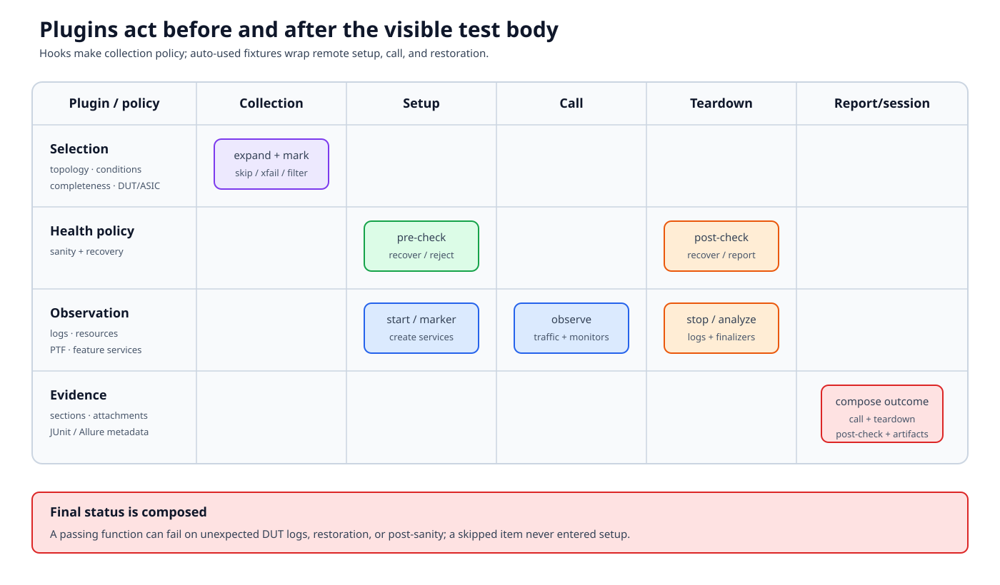

# Plugin lifecycle

Plugins make repository-wide policy executable. They select tests, construct
shared services, check the lab, bound log intervals, monitor resources, and
alter the final outcome. Their power comes from running outside the visible
test body.



## Documentation basis

| Source | Contribution |
|---|---|
| `tests/conftest.py::pytest_plugins` | Current shared plugin registration |
| [Conditional mark plugin][conditional-mark] | Fact-driven skip, xfail, and custom marks |
| [Sanity-check plugin][sanity] | Pre/post checks, recovery, marker and CLI controls |
| [Log analyzer][loganalyzer] | Bounded DUT log analysis and regex policy |
| [PTF adapter][ptfadapter] | Module-scoped PTF-agent integration |
| [Test completeness][completeness] | Debug/basic/confident/thorough collection levels |
| [Pytest logging][logging] | Console/file capture and remote-operation logging |

## Hook functions and plugin fixtures

Two mechanisms add behavior:

- **hooks** receive pytest events such as option parsing, collection, report
  generation, or session finish;
- **fixtures**, often auto-used, join the fixture graph and can wrap setup,
  call, and teardown with `yield`.

A plugin can use both. To understand one, search for `pytest_*` hooks,
`@pytest.fixture`, auto-use, fixture scope, command-line options, markers, and
finalizers.

## Collection-time policy

### Topology/custom markers

Root collection logic compares a test's topology marker with the selected
testbed type/name and applies repository selection rules. It can also validate
custom markers and generate DUT/ASIC parameters.

### Conditional marks

The conditional-mark plugin loads condition files and testbed/device facts.
For a collected node it finds matching entries, evaluates their conditions,
and applies marks such as skip or xfail. More than one mark type can apply.
When node-ID patterns overlap, current matching behavior favors the most
specific/longest matching node path with true conditions.

This creates a provenance requirement. An unexpected xfail is not explained
by the test module alone; record:

- final node ID;
- matching condition-file entry;
- collected facts;
- evaluated condition; and
- mark reason.

### Test completeness

Completeness levels express how extensively a feature should be tested:
`debug`, `basic`, `confident`, and `thorough`. The plugin filters or
parameterizes items according to the requested level. `diagnose` is treated
separately rather than as the next ordered completeness level.

Do not use completeness to encode topology compatibility or known product
defects; those are different policies.

## Setup and teardown policy

### Sanity checks

The sanity plugin currently exposes a module-scoped auto-used wrapper that
dynamically invokes the full check when appropriate. The full path can:

- run configured checks before a module;
- retry conditions such as networking uptime;
- attempt recovery actions;
- coordinate parallel execution;
- run selected checks after the module; and
- report failed checks and recovery results.

CLI options and markers control check items, recovery, and pre/post behavior.
Read the plugin README for precedence. A marker that narrows checks can change
the safety envelope for every test in its module.

Sanity has two purposes that should not be conflated:

1. reject an environment that cannot produce a meaningful test result;
2. restore a recoverable environment so later tests can proceed.

A successful recovery does not erase the original failure. Preserve both
pieces of evidence.

### Log analyzer

The log analyzer places markers around a test interval on participating DUTs,
then retrieves and evaluates logs.

Its regex sets have different semantics:

- **match**: patterns treated as unexpected errors;
- **ignore**: known messages removed from failure consideration;
- **expect**: messages that must occur for a particular test.

Module/test markers can add patterns or disable analysis. Over-broad ignore
patterns create false passes; broad match patterns create noise. Anchor
feature-specific expressions and document why an ignore is safe.

Because analysis runs after the call, a function can finish its assertions and
still have a failed final report.

### Resource and process monitors

Shared plugins can record DUT memory utilization, process CPU/memory, and
other health data. These provide correlation evidence; a transient metric is
not automatically the feature's root cause.

## PTF and feature plugins

The PTF adapter plugin creates persistent agents and interface maps used by
packet tests. Dual-ToR, decap, platform API, PDU, and other plugins contribute
feature-specific fixtures and options.

Registration at the root does not mean every fixture performs remote work for
every test. Pytest instantiates a fixture when the graph requests it, unless it
is auto-used.

## Option and marker precedence

There is no repository-wide precedence rule. Each plugin defines how it
combines:

- built-in defaults;
- configuration files;
- command-line options;
- module/class/function markers;
- collected testbed/device facts; and
- runtime observations.

For a surprising behavior, find the plugin's parser and decision function.
Documentation may explain intent; current code decides the run.

## The final report is composed

```text
collection decision
  + setup outcome
  + test-call outcome
  + teardown outcome
  + plugin post-checks
  + reporting hooks
  = user-visible node/session result
```

Examples:

| Test body | Wrapper behavior | Final result |
|---|---|---|
| Passed | Unexpected DUT error matched | Failed |
| Passed | Fixture restoration failed | Error/failed |
| Failed | Condition marked strict xfail | Expected or failed according to mark |
| Not run | Conditional skip applied | Skipped with plugin reason |
| Passed | Post-sanity recovered DUT | Result plus recovery evidence; policy determines status |

## Diagnose plugin behavior

1. Collect the exact node ID and final marker list.
2. Use `--setup-show` or fixture introspection to expose auto-used fixtures.
3. Enable the documented log level/file output.
4. Search the plugin for its pytest hooks, fixture scope, options, and markers.
5. Separate precondition, feature call, teardown, and post-check timestamps.
6. Inspect the plugin-specific evidence: evaluated conditions, sanity check
   results, log marker interval, monitor output, or PTF-agent state.

## Design and review rules

- Keep collection decisions deterministic from recorded inputs.
- Include a reason with skip/xfail and make it specific enough to retire.
- Do not catch a feature failure merely to let cleanup appear successful.
- Keep auto-used remote work scoped and visible in logs.
- Make finalizers idempotent after partial setup.
- Test plugin behavior at its pytest hook/fixture boundary, not only helper
  functions.
- Treat changes to root registration or auto-use as repository-wide changes.

The next part applies this execution model to concrete topology and lab
construction.

[conditional-mark]: https://github.com/sonic-net/sonic-mgmt/blob/master/tests/common/plugins/conditional_mark/README.md
[sanity]: https://github.com/sonic-net/sonic-mgmt/blob/master/tests/common/plugins/sanity_check/README.md
[loganalyzer]: https://github.com/sonic-net/sonic-mgmt/blob/master/tests/common/plugins/loganalyzer/README.md
[ptfadapter]: https://github.com/sonic-net/sonic-mgmt/blob/master/tests/common/plugins/ptfadapter/README.md
[completeness]: https://github.com/sonic-net/sonic-mgmt/blob/master/tests/common/plugins/test_completeness/README.md
[logging]: https://github.com/sonic-net/sonic-mgmt/blob/master/docs/tests/pytest.logging.md
