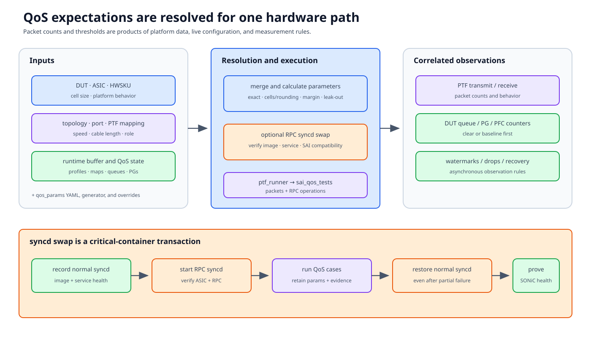

# QoS and syncd swap

QoS tests translate behavioral claims—lossless priorities, queue limits, PFC,
ECN, and watermarks—into platform-specific packet counts and thresholds. The
translation depends on ASIC, HWSKU, topology, port speed, cable length, buffer
profiles, and sometimes an RPC-capable syncd.



## Documentation basis

| Source | Contribution |
|---|---|
| `tests/qos/files/qos.md` | QoS test parameter model and file organization |
| [QoS RPC testbed guide][qos-rpc] | PTF-to-syncd RPC requirements and deployment |
| `tests/qos/conftest.py` and `qos_fixtures.py` | Current fixture resolution and setup |
| `tests/qos/qos_sai_base.py` | Shared QoS SAI execution and parameter handling |
| `tests/qos/test_qos_sai.py` | QoS scenario entry points |
| `tests/qos/files/qos_params.*.yaml` and vendor generators | ASIC/platform parameter data |
| `ansible/swap_syncd.yml` and Docker helpers | syncd image replacement/restoration |

## Parameter resolution

A QoS test does not start from one universal expected packet count.

```text
DUT + ASIC + HWSKU
  + topology and port role
  + port speed and cable length
  + active buffer/QoS configuration
  + platform parameter YAML/generator
  = resolved scenario parameters
```

Current parameter files are split by ASIC/platform families. The conftest and
helpers combine generic and platform-specific sections, then may adjust values
for the selected speed, topology, or runtime configuration.

Preserve the resolved parameter dictionary as evidence. The filename alone is
insufficient when generators, overrides, or runtime facts changed it.

## What the parameters mean

Common categories include:

- lossless/lossy priorities and DSCP mappings;
- PFC XOFF/XON packet thresholds;
- headroom and shared-buffer limits;
- queue and priority-group watermark expectations;
- cell size and rounding behavior;
- packet leak-out or pipeline allowance;
- margin/tolerance around counters; and
- test ports and PTF indices.

A threshold may be:

- an exact protocol expectation;
- a byte-to-cell conversion rounded by ASIC rules;
- an empirical/platform allowance; or
- a range widened for observable pipeline traffic.

Document which category applies. A copied constant that happens to pass one
HWSKU is not a portable contract.

## Runtime path

A typical QoS SAI case:

1. selects a DUT and frontend ASIC;
2. resolves source/destination ports and PTF indices;
3. reads active speed, cable length, buffer and QoS facts;
4. merges platform parameter data;
5. prepares PTF-side tests/configuration;
6. launches a remote `sai_qos_tests` case through `ptf_runner`;
7. communicates with the DUT's RPC service when required;
8. reads packet results and DUT counters/watermarks; and
9. restores DUT/container state.

The PTF packet process and DUT counter read are separate evidence sources.

## Why syncd may be swapped

Normal SONiC syncd is part of the orchagent/SAI pipeline and may not expose the
RPC interface expected by a PTF-side SAI QoS test. With
`--qos_swap_syncd`, session setup can replace it with an RPC-capable syncd
image and teardown restores the default.

This operation changes a critical DUT container:

```text
record normal syncd identity/state
  -> stop/remove or swap container
  -> start RPC-capable syncd
  -> verify RPC and ASIC readiness
  -> run QoS tests
  -> restore normal syncd
  -> verify ordinary SONiC services and forwarding
```

An RPC port accepting TCP connections does not prove the expected SAI version
or ASIC initialization. Check image identity, process/log health, and one
compatible operation.

If setup fails halfway through, do not continue with unrelated tests until the
running container and normal SONiC pipeline are verified.

## Packet and counter measurement

For each assertion, identify:

- packets offered to the ingress port;
- target priority/queue/PG;
- expected buffering or drop transition;
- counter/watermark sampled;
- cell/byte conversion;
- leak-out and background allowance; and
- acceptable range.

Clear or baseline counters before the interval. Some counters are cumulative,
some update asynchronously, and watermarks may require explicit clear/read
semantics.

For PFC:

- verify the packet maps to the intended lossless priority;
- distinguish generated PFC from received/responded PFC;
- separate XOFF trigger from XON recovery;
- check pause state does not leak into the next test; and
- correlate PTF traffic with DUT PFC/PG/queue counters.

## Port selection and topology

Port speed, cable length, and role can change the active buffer profile. Keep:

```text
(DUT, ASIC, SONiC port, speed, cable length, PTF host/port, queue/PG)
```

Do not select a port solely because its PTF index exists. Check admin/oper
state, topology role, port-channel membership, and whether the platform
parameter set supports that speed/mode.

## Failure localization

| Symptom | First boundary |
|---|---|
| Parameter key missing | ASIC/HWSKU file merge or unsupported mode |
| RPC connection refused | Swapped syncd image/process/tunnel/port |
| RPC method/status incompatible | Client/server/SAI version mismatch |
| No packets at DUT | PTF map and packet construction |
| Counters move on wrong queue/PG | DSCP/priority/QoS map resolution |
| Threshold off by a small fixed amount | Cell rounding, leak-out, counter timing |
| Large or unstable error | Port state, offered traffic, stale counters, profile mismatch |
| Later tests lose normal forwarding | syncd restoration or stale QoS config |

## Review checklist

- Is the resolved parameter set recorded?
- Are ASIC/HWSKU/speed/cable/topology supported?
- Does every tolerance have a hardware/measurement rationale?
- Are counter clear and observation intervals explicit?
- Is RPC syncd identity verified before testing?
- Is normal syncd and SONiC health proven after teardown?

[qos-rpc]: https://github.com/sonic-net/sonic-mgmt/blob/master/docs/testbed/README.testbed.QosRpc.md
