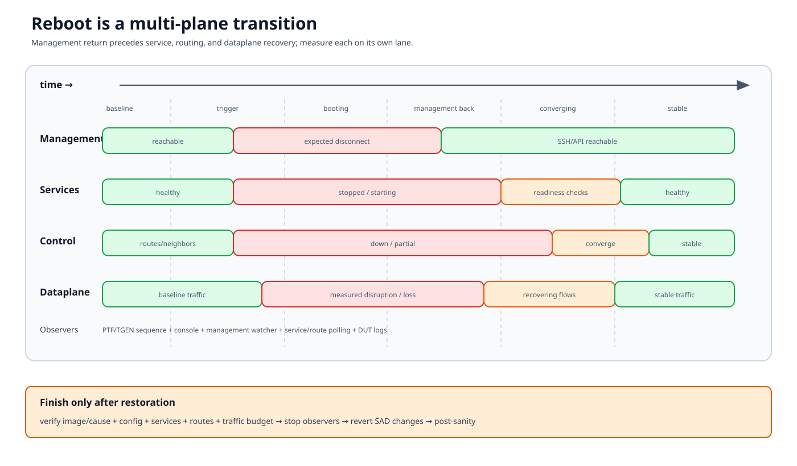

# Reboot and upgrade testing

A reboot test validates a transition. “The DUT answered SSH again” is one
checkpoint between a trigger and restored trustworthy forwarding.



## Documentation basis

| Source | Contribution |
|---|---|
| `tests/platform_tests/test_reboot.py` | Basic reboot types and post-reboot platform checks |
| `tests/platform_tests/test_advanced_reboot.py` | Advanced reboot scenario entry points |
| `tests/common/fixtures/advanced_reboot.py` | PTF/responders, reboot orchestration, SAD operations, and cleanup |
| `ansible/roles/test/files/ptftests/py3/advanced-reboot.py` | Remote continuous-traffic observation |
| `ansible/roles/test/files/ptftests/py3/sad_path.py` | Route/neighbor/link disruption operations |
| `tests/snappi_tests/reboot/` | Traffic-generator-based reboot measurements |
| Platform/upgrade test plans and helpers | Image installation, trust, rollback, and platform-specific behavior |

## Two common levels

### Basic reboot/platform validation

`test_reboot.py` covers cold, soft, fast, warm, and related reboot paths as
supported. The surrounding helper verifies more than reconnect:

- reboot cause/type;
- critical process health;
- interface/transceiver/platform state;
- service readiness; and
- topology-appropriate postconditions.

This level asks whether the platform performed and recovered from the intended
reboot.

### Advanced reboot with traffic

`test_advanced_reboot.py` and `get_advanced_reboot` coordinate:

- DUT reboot/install actions;
- remote PTF continuous traffic;
- route/neighbor responders;
- control-plane observations;
- optional SAD-path operations; and
- restoration.

This level asks how forwarding behaved through the transition, including loss
and disruption duration.

Snappi reboot tests can measure similar transitions through a traffic
generator. Their metric boundary differs from PTF, but the state-machine
discipline is the same.

## State machine

### 1. Baseline

Record:

- running image/version and next boot image;
- uptime and expected reboot cause behavior;
- selected DUT/ASIC/topology;
- config checkpoint or restoration source;
- interfaces, port-channels, routes, neighbors, and critical services;
- PTF/TGEN mappings and responder state;
- console/PDU recovery access; and
- time synchronization among observers.

Prove baseline traffic before triggering the event. A missing post-reboot
packet is uninterpretable if it never flowed before reboot.

### 2. Arm observers

Start continuous traffic and watchers before the trigger. Record start
timestamps and readiness. Possible observations include:

- packet sequence/timestamps at PTF or TGEN;
- DUT management disconnect/reconnect;
- route/neighbor/BGP changes;
- critical-process and container state;
- interface state; and
- console logs.

The test runner must survive the DUT management interruption.

### 3. Trigger and expected loss of management

Issue the intended reboot or installation command and verify that the expected
transition begins. A command returning success is not the reboot result.

Classify:

- trigger rejected or returned unexpectedly;
- DUT did not disconnect;
- disconnect occurred but wrong boot path was taken; or
- observer failed before the DUT event.

### 4. Dataplane disruption window

Continuous traffic identifies last-good, first-bad, last-bad, and first-good
observations. The precise metric depends on PTF/TGEN implementation and flow
direction.

Keep separate:

- control-plane downtime;
- management downtime;
- dataplane disruption;
- individual flow loss; and
- permanent versus transient loss.

Clock accuracy and packet rate determine measurement resolution.

### 5. Management and service return

Management reachability is followed by:

1. SSH/API readiness;
2. SONiC containers and critical processes;
3. database/config migration;
4. interface and transceiver readiness;
5. neighbor and routing convergence; and
6. stable dataplane.

Use condition polling with platform-appropriate deadlines. A fixed sleep
followed by one check hides which subsystem was late.

### 6. Postconditions and restoration

Verify:

- running image/version and reboot cause;
- expected config persistence;
- critical service/process health;
- routes, neighbors, ports, and traffic;
- loss/disruption budget; and
- no unexpected DUT log patterns.

Undo SAD-path operations, stop traffic/responders, restore image/config
intent, and run post-sanity. Do not start another case while recovery is
incomplete.

## SAD-path scenarios

SAD operations deliberately modify routes, neighbors, or links during the
reboot window. They are distributed transactions:

```text
prepare operation
  -> confirm baseline
  -> reboot + operation timing
  -> observe forwarding
  -> revert every applied change
  -> confirm route/link/neighbor convergence
```

Record which changes completed. Cleanup must handle a failure after only a
subset was applied.

## Upgrade adds version and trust state

An upgrade test must record:

- source and target image identifiers;
- installer source and verification/trust expectation;
- available disk and image list before/after;
- boot selection and fallback;
- configuration/schema migration expectations;
- running version after boot; and
- rollback plan.

Secure-upgrade tests validate rejection/acceptance behavior as well as boot.
Never expose signing keys, tokens, or protected image locations in logs.

Installation success without booting the target is not upgrade success.
Booting the target without restored services/traffic is not system recovery.

## Operational safeguards

- Reserve the testbed for trigger plus worst-case recovery.
- Verify console and PDU mappings before the run.
- Preserve baseline config and current image.
- Know platform-specific timeout and reboot support.
- Prevent a second worker from using the DUT/PTF/TGEN resources.
- Retain continuous-traffic and console artifacts.
- Define when automated recovery stops and human intervention begins.

## Failure taxonomy

| Category | Evidence |
|---|---|
| Baseline invalid | Pre-traffic, sanity, service/link state |
| Trigger failure | Command/console response, no expected disconnect |
| Boot failure | Console/bootloader, management never returns |
| Wrong image/cause | Running version and reboot-cause checks |
| Service readiness failure | Container/process/interface timeline |
| Control-plane convergence | BGP/route/neighbor timestamps |
| Dataplane budget failure | PTF/TGEN per-flow sequence/metrics |
| Restoration failure | SAD/config/image cleanup and post-sanity |
| Observer failure | PTF/TGEN process/log gap independent of DUT |

## Review checklist

- Is the exact reboot/upgrade contract platform-supported?
- Does the baseline prove traffic and recovery access?
- Are management, control-plane, and dataplane timelines separate?
- Is measurement resolution sufficient for the threshold?
- Does cleanup restore partially applied SAD operations?
- Is the running target image verified after boot?
- Are later tests blocked until post-sanity is clean?
