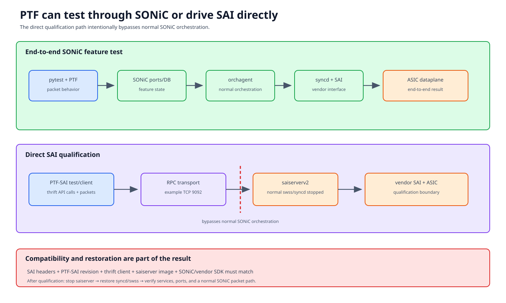

# SAI and PTF testing

“PTF” identifies a packet-test mechanism. “SAI” identifies the API boundary
under test. A normal SONiC pytest can use PTF end to end, while a SAI
qualification workflow intentionally replaces normal SONiC forwarding
services and drives vendor SAI through RPC.



## Documentation basis

| Source | Contribution |
|---|---|
| [SAI quality README][sai-quality] | Workflow index and compatibility emphasis |
| [PTF-SAIv2 testing guide][ptf-saiv2] | SAI/PTF environment, branch/version relationships, client/server behavior |
| [Deploy SAI test topology][deploy-sai] | SONiC-mgmt testbed and container deployment example |
| `tests/sai_qualify/` | Current pytest orchestration of SAI suites |
| `tests/saitests/` | PTF-side SAI test code retained in this repository |
| `tests/scripts/sai_qualify/` | DUT service/container preparation and restoration scripts |
| `ansible/swap_syncd.yml` | RPC syncd swap used by some workflows |

The SAI quality documents are operational guides tied to particular branches,
images, vendors, and tool revisions. Follow the matching branch rather than
combining commands from different snapshots.

## Three distinct test layers

### 1. End-to-end SONiC feature test

```text
pytest -> PTF packet -> SONiC ports
       -> orchagent / syncd / SAI -> ASIC
```

The test validates SONiC behavior through its normal control and forwarding
stack. PTF is only the traffic endpoint.

### 2. QoS or helper test using RPC syncd

Some suites swap normal syncd for an RPC-capable variant while retaining more
of the SONiC test context. The exact bypass depends on the image/service.

### 3. Direct SAI qualification

```text
pytest/qualification harness
  -> PTF SAI test + thrift client
  -> saiserverv2 on DUT
  -> vendor SAI
  -> ASIC / virtual dataplane
```

The direct path bypasses normal orchagent behavior. A pass demonstrates the
SAI/server/ASIC contract exercised by that case, not end-to-end SONiC feature
correctness.

## Compatibility is a matrix

The following must agree:

- SAI API/header revision;
- PTF-SAI test branch/revision;
- generated thrift client bindings;
- saiserver or RPC-syncd image;
- SONiC branch/build and vendor SDK;
- Python/PTF runtime; and
- vendor/platform capabilities.

Exact matches may be required. A TCP connection to the RPC port proves
transport only; method IDs, attributes, enum values, and object behavior can
still be incompatible.

Record all revisions and image digests in the result.

## Direct saiserver workflow

The documented PTF-SAIv2 example uses a PTF/non-topology-style environment, a
PTF-SAI container on the test side, and `saiserverv2` on the DUT. An example
thrift endpoint uses TCP port 9092. Treat address/port as deployment data, not
a universal constant.

A safe high-level sequence is:

1. reserve DUT/PTF and prove console/recovery access;
2. record normal SONiC image, syncd/swss/container state, and config;
3. verify the compatibility matrix;
4. copy/install the matching PTF-SAI client/tests;
5. stop normal services required by the guide, commonly swss/syncd for direct
   saiserver ownership;
6. start the exact saiserver image and verify initialization/logs/RPC;
7. run one non-destructive API smoke operation;
8. execute selected SAI cases and collect status/log/capture evidence;
9. stop saiserver and restore normal services/containers; and
10. run SONiC health and forwarding checks.

Stopping swss/syncd is intentional in direct mode because two owners must not
program the ASIC simultaneously.

## Test result semantics

A SAI operation can fail at:

| Boundary | Evidence |
|---|---|
| RPC transport | Connection/refusal/timeout |
| Thrift/API compatibility | Unknown method, serialization, invalid attribute |
| SAI validation | Returned SAI status |
| Vendor implementation | saiserver/SDK logs, crash, unsupported behavior |
| ASIC/dataplane | Packet/counter/state mismatch |
| Test expectation | Incorrect object lifecycle or capability assumption |

Preserve the numeric/symbolic SAI status and the exact call parameters. A
generic Python exception loses the most useful qualification evidence.

## PTF data path and port mapping

Direct SAI tests still need correct PTF-to-DUT port identity. Depending on the
topology and server mode, this may be a direct PTF mapping without routed
neighbor VMs. Record DUT port, SAI port object/attribute mapping, PTF
device/port, and ASIC ownership.

Do not import a minigraph mapping assumption from a normal SONiC test if the
saiserver workflow rebuilt or bypassed configuration differently.

## Restoration is part of qualification

After testing, verify:

- saiserver stopped;
- normal syncd/swss/container images and services restored;
- Config DB/minigraph baseline restored as intended;
- critical processes and ASIC initialization healthy;
- management and front-panel interfaces up;
- a normal end-to-end SONiC packet smoke test passes; and
- no RPC tunnel/process remains.

If restoration fails, quarantine the testbed. A direct SAI environment can
make later SONiC failures meaningless.

## Review checklist

- Which of the three layers is actually under test?
- Is the full compatibility matrix immutable and recorded?
- Which normal SONiC services are intentionally bypassed?
- Is the RPC endpoint and PTF port mapping explicit?
- Are SAI status, saiserver/SDK logs, and packet evidence retained?
- Does cleanup prove normal SONiC forwarding, not only container presence?

[sai-quality]: https://github.com/sonic-net/sonic-mgmt/blob/master/docs/testbed/sai_quality/README.md
[ptf-saiv2]: https://github.com/sonic-net/sonic-mgmt/blob/master/docs/testbed/sai_quality/PTF-SAIv2TestingGuide.md
[deploy-sai]: https://github.com/sonic-net/sonic-mgmt/blob/master/docs/testbed/sai_quality/DeploySAITestTopologyWithSONiC-MGMT.md
