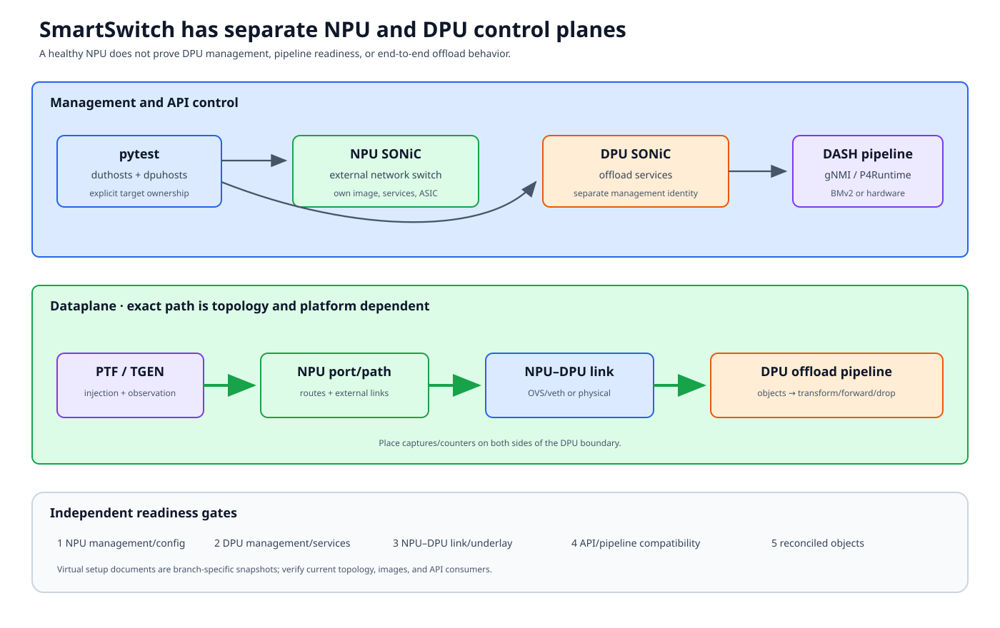

# SmartSwitch and DPU topologies

A SmartSwitch is a system of systems: an NPU-side SONiC switch and one or more
DPU-side SONiC instances cooperate to provide network and offload behavior.
Tests must name the target explicitly; “the DUT” is ambiguous.



## Documentation basis

| Source | Contribution |
|---|---|
| [SmartSwitch virtual setup][smartswitch-vs] | KVM/container placement, OVS links, NPU/DPU/PTF/cEOS topology, and manual setup |
| [Virtual SmartSwitch guide][vsmartswitch] | Additional virtual topology flow and diagrams |
| `ansible/vars/topo_smartswitch-*.yml` and `topo_t1-smartswitch.yml` | Logical link and neighbor variants |
| `tests/conftest.py` and SmartSwitch conftests | DPU host construction and shared fixtures |
| `tests/smartswitch/` | DPU platform, reload, and system tests |
| `tests/dash/` and `tests/snappi_tests/dash/` | DASH configuration and dataplane/HA scenarios |

The virtual setup guide includes branch-specific and manual steps, and some
sections describe evolving work. Treat it as a worked environment snapshot.
Verify current topology vars, images, APIs, and scripts before provisioning.

## Roles

### NPU host

The NPU-side SONiC instance owns external switch ports and surrounding
T0/T1-style network behavior. It can be healthy while a DPU pipeline is not.

### DPU host

A DPU runs its own SONiC services and programmable/offload pipeline. It has
separate management identity, image, service state, interfaces, and logs.
Physical systems may have several DPUs.

### PTF and neighbors

PTF injects/observes at topology endpoints. cEOS or other neighbors model the
network around the NPU. OVS/veth links realize virtual NPU-DPU and PTF paths.

### DASH control

DASH tests configure offload objects and validate packet behavior. Depending
on the environment, control boundaries can include gNMI and P4Runtime toward a
DASH/BMv2 or hardware pipeline. Record which API and target owns each object;
do not generalize one virtual backend to all DPUs.

## Four planes

| Plane | Examples |
|---|---|
| Management | SSH/Ansible to NPU and each DPU; test-server/container control |
| NPU network | External ports, neighbors, routes, SONiC services |
| DPU control | DPU SONiC, DASH objects, gNMI/P4Runtime or vendor API |
| Dataplane | PTF → NPU link → DPU pipeline → destination, variant-dependent |

Minigraph/network configuration and DPU management setup are separate
operations in the documented virtual workflow. Success in one does not imply
the other.

## Fixture and identity model

Root framework options can create `dpuhosts` when a DPU host pattern is
supplied. SmartSwitch conftests add DPU setup and log-analysis policy.

Preserve:

```text
(SmartSwitch system, NPU hostname/ASIC/interface,
 DPU hostname/pipeline/interface, PTF host/port, API endpoint)
```

If the test uses several DPUs, derive role/connection from topology data rather
than sorting hostnames.

## Virtual realization

The documented KVM setup includes:

- an NPU SONiC VM;
- a DPU SONiC VM;
- cEOS neighbors;
- a PTF container;
- OVS bridges/veth links;
- DPU management and minigraph configuration; and
- a DASH pipeline such as BMv2 for software validation.

Validate in layers:

1. NPU/DPU/neighbor images boot and management works;
2. topology creates expected PTF, OVS, and VM interfaces;
3. NPU and DPU network configuration is applied;
4. underlay/link reachability exists between owning endpoints;
5. DPU pipeline/API initializes with compatible versions;
6. DASH objects reconcile into the intended pipeline; and
7. packets traverse the expected NPU/DPU path.

## DASH test lifecycle

A scenario should expose:

### Configuration

- target DPU/API endpoint;
- object dependencies and stable IDs;
- underlay/overlay addresses;
- expected NPU/DPU route/neighbor state; and
- PTF/traffic-generator endpoints.

### Reconciliation

Do not assume an accepted API write is programmed. Poll the supported
operational state or correlated pipeline/SAI evidence.

### Traffic

For each direction, state whether the packet should:

- enter through NPU and be processed by DPU;
- enter/exit a DPU-facing endpoint;
- be encapsulated, translated, forwarded, or dropped; and
- be observed on PTF, Snappi, NPU counters, DPU counters, or pipeline logs.

### Cleanup

Delete objects in dependency-safe reverse order and restore NPU/DPU state.
Cleanup must run against the same DPU that owned configuration. A reload is a
last-resort recovery, not a substitute for understanding object ownership.

## Platform and reload tests

`tests/smartswitch/platform_tests/` covers DPU platform facts, temperature,
and reload behavior. A DPU reload is a separate transition from an NPU reboot:
observe DPU management, services, pipeline, NPU-facing connectivity, and
end-to-end traffic. Define whether other DPUs and the NPU should remain
unaffected.

## Failure boundaries

| Symptom | First boundary |
|---|---|
| NPU reachable, DPU absent | DPU inventory/management/image |
| DPU reachable, pipeline unavailable | DPU services, API/version, BMv2/hardware backend |
| API accepts object, no state | Reconciliation/dependency/underlay |
| Correct NPU route, no packet | NPU-DPU OVS/physical link and pipeline |
| Packet reaches DPU, wrong transform | DASH object/pipeline behavior |
| Only NPU logs collected | DPU fixture/log ownership |
| Following test sees stale object | DPU-specific cleanup or reload recovery |

## Review checklist

- Is every operation labeled NPU, one DPU, or whole system?
- Are management, minigraph, API, and dataplane readiness separate?
- Are virtual-guide assumptions identified as version-specific?
- Is DPU/API/pipeline compatibility recorded?
- Are packet observations placed on both sides of the DPU boundary?
- Does cleanup remove objects and restore the owning DPU?

[smartswitch-vs]: https://github.com/sonic-net/sonic-mgmt/blob/master/docs/testbed/README.testbed.SmartSwitch.VsSetup.md
[vsmartswitch]: https://github.com/sonic-net/sonic-mgmt/blob/master/docs/testbed/README.testbed.vSmartSwitch.md
