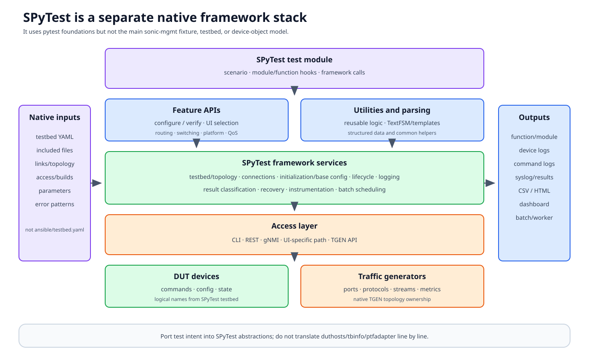

# SPyTest architecture

SPyTest lives in the same repository and uses pytest as a foundation, but it
is a separate automation framework with its own testbed schema, APIs,
lifecycle, traffic-generator integration, reports, and batch scheduler. Main
pytest fixtures such as `duthosts`, `tbinfo`, and `ptfadapter` are not
its programming model.



## Documentation basis

| Source | Contribution |
|---|---|
| [SPyTest introduction][spytest-intro] | Framework concepts, APIs, testbed, execution, logging, reporting, and batch mode |
| `spytest/Doc/` | Command-line, topology, traffic-generator, result, and feature guides |
| `spytest/spytest/` | Framework runtime, connections, hooks, result and batch implementation |
| `spytest/apis/` | Feature-facing configuration and verification APIs |
| `spytest/utilities/` | Reusable device-independent utilities |
| SPyTest testbed examples/templates | Native lab schema and topology declarations |

## Layered programming model

### Test module

A test expresses scenario intent using SPyTest functions and feature APIs.
Module/function setup and cleanup use framework-native hooks.

### Feature APIs

APIs encapsulate configuration and verification for routing, switching,
platform, QoS, and other features. They can hide CLI syntax, UI type, version,
and parsing differences.

Review an API's actual supported UI paths and return contract; abstraction
does not guarantee identical semantics on every backend.

### Utilities and parsing

Utilities provide reusable logic independent of one feature or device.
TextFSM templates and parsers convert CLI output to structured records.
Parser/template drift is a distinct failure from the device command itself.

### Framework services

The framework owns:

- testbed loading and topology validation;
- device/TGEN connections;
- logging, result classification, and instrumentation;
- initialization and base configuration;
- module/function lifecycle;
- failure handling and recovery;
- topology-aware selection; and
- batch scheduling.

### Access and targets

Commands may use CLI, REST, gNMI, UI-specific mechanisms, or traffic-generator
APIs. The framework maps logical device names to DUT/TGEN endpoints.

## Native testbed model

A SPyTest testbed YAML can declare:

- DUT and TGEN devices;
- access and credentials;
- links and topology constraints;
- build/image and configuration profiles;
- services and parameters;
- speed/port information;
- error/syslog patterns; and
- instrumentation.

Included YAML files can compose larger definitions.

This is not `ansible/testbed.yaml`. Both describe labs, but their schemas,
parsers, role names, deployment assumptions, and fixture/object models differ.
Do not point one framework at the other's file and infer compatibility from
similar field names.

## Execution lifecycle

```text
load framework options and testbed
  -> validate requested topology
  -> connect DUTs and traffic generators
  -> apply initialization / base config
  -> module prologue
  -> function setup
  -> test scenario
  -> function cleanup
  -> module epilogue
  -> restore / disconnect
  -> logs, CSV/HTML results, dashboard inputs
```

The exact initialization mode is configurable. Determine whether a run applies
base config, user config, image loading, or leaves existing state.

As with main pytest, the visible test function is not the entire outcome.
Framework hooks, syslog/error-pattern checks, cleanup, and result
classification can change the result.

## Initialization and baseline ownership

SPyTest can establish a known base configuration before modules. That improves
repeatability but changes the meaning of “pre-existing state.” A test should
not rely on undeclared lab configuration that the framework may erase.

Module prologue can create expensive shared feature state; module epilogue
owns its restoration. Function setup/cleanup should isolate per-case changes.
Use framework APIs so the lifecycle can log and recover operations.

## Traffic-generator integration

When the testbed declares TGEN devices/links, framework TGen APIs configure
ports, protocols, streams, and metrics. Port identity belongs to the SPyTest
testbed topology.

Apply the same measurement discipline as Snappi:

- reserve and validate ports;
- separate convergence, warm-up, measurement, fault, and recovery;
- preserve generated streams and metrics;
- correlate DUT counters; and
- clean sessions after partial failure.

The concrete TGEN backend and API support are framework/environment-specific.

## Results and diagnostics

SPyTest writes multiple result and log files for functions, modules, devices,
commands, syslog, and execution summaries. Batch runs add worker and scheduling
evidence.

Start triage with:

1. framework/testbed/options summary;
2. selected topology and devices;
3. module/function result row;
4. first causal command/API failure;
5. corresponding DUT/TGEN log;
6. cleanup/epilogue outcome; and
7. worker/batch status if distributed.

Do not diagnose from the final dashboard cell alone.

## Batch execution

Batch mode can distribute modules according to topology needs and available
testbeds/workers. A missing or delayed test can result from topology
constraints, worker health, or scheduling—not source collection alone.

Shared labs still require ownership: worker isolation, module state, TGEN
ports, logs, and recovery must not collide.

## Main pytest versus SPyTest

| Concern | Main SONiC pytest framework | SPyTest |
|---|---|---|
| Lab description | Ansible inventory + testbed/topology/graph | SPyTest testbed YAML and includes |
| Device objects | `SonicHost`, `SonicAsic`, neighbors, PTF | Framework DUT/TGEN handles and APIs |
| Test dependencies | pytest fixtures/plugins | SPyTest framework APIs/hooks |
| Packet/TGEN | PTF adapter/runner, Snappi fixtures | Framework TGen/PTF support |
| Baseline | Deployment plus pytest fixture/plugin policy | Framework initialization/base config |
| Results | pytest logs, JUnit, Allure, CI reporting | SPyTest logs/results/dashboard/batch artifacts |

They can validate the same SONiC feature but should do so in their native
abstractions.

## How to learn or port a test

1. Read the [SPyTest introduction][spytest-intro] and one matching testbed.
2. Choose a small test and list every framework/API call.
3. Trace one feature API through UI selection, device call, and parser.
4. Locate module/function setup and cleanup.
5. Run or inspect topology validation and result files.
6. For a port, restate intent and rebuild it in native APIs; do not translate
   main-pytest fixture calls line by line.

## Review checklist

- Is the test using SPyTest-native testbed and APIs?
- Are supported UI/backend variants explicit?
- Does setup/cleanup match module/function ownership?
- Are parser failures distinct from device failures?
- Are TGEN ports and batch workers isolated?
- Are all result/log locations retained for triage?

[spytest-intro]: https://github.com/sonic-net/sonic-mgmt/blob/master/spytest/Doc/intro.md
