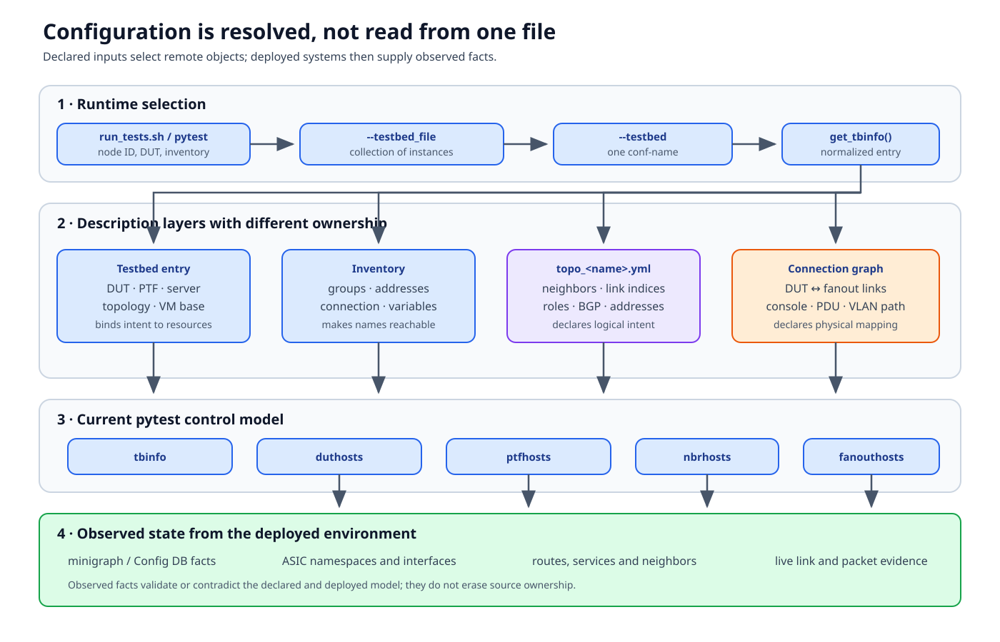

# Topology and configuration

The word *topology* is overloaded in `sonic-mgmt`. It may refer to installed
cabling, a logical network pattern such as T0, a specific topology variant
such as `t0-56`, or one deployed testbed instance. Treating those as the same
object is the source of many selection and port-mapping mistakes.

This chapter follows the configuration chain from a pytest command to live
devices. [Testbed architecture](architecture.md) explains how the resulting
components communicate.



## Documentation basis

| Existing source or current code | Contribution to this chapter |
|---|---|
| [Testbed overview][testbed-overview] | Physical and logical topology vocabulary |
| [Testbed setup][testbed-setup] | Inventory, testbed, connection-graph, and deployment inputs |
| [New testbed configuration][new-config] | YAML testbed schema and how topology names bind to resources |
| [Pytest overview][pytest-overview] and [run guide][pytest-run] | Runtime selection options and test invocation |
| `tests/common/testbed.py::TestbedInfo` | Current parsing and normalization of the selected testbed entry |
| `tests/conftest.py::get_tbinfo` and `tbinfo` | Current pytest entry point for testbed data |
| `ansible/vars/topo_*.yml` | Logical topology declarations |
| `tests/common/devices/` and minigraph/config helpers | Runtime host objects and observed DUT mappings |

The old `pytest.org.md` document describes an early organization proposal.
It is useful history, but the current `tests/conftest.py`, plugins, and
fixtures are the authority for present execution behavior.

## Four meanings of topology

### 1. Physical topology

The physical topology is installed equipment and cabling: test-server trunks,
root and leaf fanouts, DUT ports, console servers, PDUs, and any direct
DUT-to-DUT links. A connection graph names those links and infrastructure
relationships.

It answers:

> Which physical path and recovery equipment belong to this DUT interface?

The declaration does not prove the live cable, optic, trunk, or fanout state.
Those are observed during deployment and sanity checks.

### 2. Logical topology family

A family describes the network role presented to the DUT:

| Family | Logical role |
|---|---|
| `t0` | A ToR with modeled servers below and routed T1 neighbors above |
| `t1` | A leaf/spine layer with T0 neighbors below and T2 neighbors above |
| `t2` | Multiple DUTs or line cards with larger neighbor groups |
| `ptf` | Selected DUT ports exposed to PTF without routed neighbor VMs |
| `ptp` | Direct DUT-to-DUT links, normally without PTF on that path |

Dual-ToR, chassis, SmartSwitch, and traffic-generator families extend this
model with extra devices or services.

### 3. Topology variant

A file such as `ansible/vars/topo_t0-8.yml` gives one concrete shape to a
family. Common sections include:

- `topology.host_interfaces`: direct PTF-facing links;
- `topology.VMs`: neighbor names, VM offsets, and VLAN/link indices;
- `topology.DUT`: DUT indices and topology-specific attributes;
- `configuration_properties`: shared addressing or protocol properties; and
- `configuration`: per-neighbor interfaces and BGP sessions.

The integers are topology indices. They are not automatically SONiC interface
numbers, PTF device/port tuples, VLAN IDs, or fanout ports.

### 4. Testbed instance

A testbed entry binds one variant to concrete resources:

```yaml
- conf-name: vms-example-t0
  topo: t0
  ptf: ptf_vms-example
  server: server_1
  vm_base: VM0100
  dut:
    - dut-01
  inv_name: lab
```

This says “realize this logical topology using these named resources.” The
inventory must still explain how to reach those names, and deployment must
still build the environment.

## The resolution chain

No single file is the complete testbed. Pytest combines several descriptions
and then asks live systems for facts.

### Stage 1: command-line selection

The supported wrapper is `tests/run_tests.sh`. It constructs the pytest
invocation and passes selections such as DUT, testbed, inventory, test path,
and extra pytest options. Direct pytest invocation is also possible, but local
options contributed by a directory's `conftest.py` are available only after
pytest knows that test path; the run guide documents the required argument
ordering.

Two options are fundamental:

- `--testbed_file` identifies the YAML or CSV collection;
- `--testbed` selects one named entry from it.

In current code, `get_tbinfo()` requires both, constructs a cached
`TestbedInfo`, and returns the normalized entry. The session-scoped
`tbinfo` fixture exposes it to tests and other fixtures.

### Stage 2: inventory resolution

Ansible inventory answers “how do I reach this name?” It contributes groups,
management addresses, connection types, credentials, and host/group
variables. It does not choose the testbed or define its logical links.

The selected testbed entry can refer to different inventories for DUTs, VMs,
or other infrastructure. A name existing in YAML but missing from the active
inventory is a description-resolution failure, not a dataplane failure.

### Stage 3: topology declaration

The selected `topo` value resolves to a topology variables file. That file
defines logical neighbors, direct host interfaces, DUT indices, and protocol
configuration. Deployment consumes it to create neighbor interfaces, OVS
bridges, PTF links, and DUT configuration.

The topology file expresses intent. Pytest later uses normalized topology
properties from `tbinfo` for selection and fixture behavior, but it does not
redeploy a different topology because a test marker requested one.

### Stage 4: physical connection data

Connection-graph data maps DUT ports to fanout ports and can describe console,
power, and related infrastructure. Fixtures such as `conn_graph_facts` and
`fanouthosts` load this layer when a test needs wiring knowledge or link
control.

The connection graph and topology file solve different mappings:

- topology: “this logical index represents an upstream neighbor link”;
- connection graph: “this DUT interface is cabled through this fanout port and
  VLAN path.”

### Stage 5: observed runtime facts

Many tests use the deployed DUT as the final authority:

- `get_extended_minigraph_facts(tbinfo)` exposes interfaces, neighbors,
  port-channels, VLAN members, and PTF indices derived from the active
  configuration;
- `config_facts()` reads Config DB-oriented state;
- command and shell helpers observe services, routes, interfaces, and ASIC
  namespaces.

This stage can reveal drift: the declaration selected the right environment,
but the live image, minigraph, cable, or service state differs.

## From names to host objects

Shared fixtures turn resolved names into Python control objects:

| Fixture | What it represents | Important cardinality |
|---|---|---|
| `duthosts` | The selected DUT set through `DutHosts`/`SonicHost` objects | One or many DUTs; may expose frontend and supervisor subsets |
| `ptfhosts` | PTF hosts for the selected servers | Zero, one, or many depending on topology |
| `ptfhost` | Compatibility view of the first PTF host | Assumes the first host is sufficient |
| `nbrhosts` | Named routed neighbors and their host objects | Empty when the topology has no neighbor VMs |
| `fanouthosts` | Fanouts discovered from connection data and inventory | Depends on physical graph availability |
| `tbinfo` | Normalized selected testbed metadata | One entry for the session |

The fixture object is local; the device is remote. Calling
`duthost.shell(...)` eventually invokes an Ansible module through the host
wrapper. [Fixtures and device objects](fixtures-and-hosts.md) follows that
boundary in detail.

## Topology markers select compatibility

A test declares compatible families:

```python
pytestmark = [
    pytest.mark.topology("t0", "t1"),
]
```

The marker is a compatibility rule evaluated during collection. It does not
request deployment and cannot transform a selected T0 testbed into T1.
Conditional-mark plugins can add skip, xfail, or topology constraints using
facts and external mark files; that is a separate collection layer.

Use exact variants only when behavior truly depends on that variant. Family
markers keep a test reusable; role and capability checks should express the
remaining constraints.

## A port has multiple identities

For a packet test, “port 3” is incomplete. The same path can have:

```text
logical topology index
        |
        v
PTF host + device/port tuple
        |
        v
server namespace/veth/OVS/VLAN interface
        |
        v
fanout VLAN + fanout physical port
        |
        v
DUT hostname + ASIC namespace + SONiC interface
```

Translate with topology properties and live minigraph/config facts. In a
multi-server or multi-ASIC environment, include the owning PTF host and ASIC
namespace; a global integer is not a stable coordinate.

## Precedence is not one universal stack

Different values follow different chains. Avoid assuming that “runtime facts
always override YAML” or that “CLI always wins.”

| Value | Typical source/precedence |
|---|---|
| Selected testbed name | CLI option |
| Concrete DUT/PTF/server names | Selected testbed entry |
| Reachability and credentials | Active inventory and variables |
| Logical neighbor/link intent | Topology variables |
| Physical cable/fanout relationship | Connection graph |
| Active interfaces, namespaces, routes, services | Live device facts |
| Skip/xfail decision | Markers, plugin options, condition files, collected facts |
| Recovery behavior | Plugin options, marker data, fixture/plugin implementation |

The right question is “which consumer produced this value?” Start at the
fixture or helper and trace its inputs.

## Worked trace: where did this DUT interface come from?

Suppose a test expects `Ethernet8` for one PTF index.

1. Record the pytest node ID, `--testbed`, `--testbed_file`, inventory, and
   DUT selection.
2. Inspect the selected testbed entry and note `topo`, DUT list, PTF/server
   fields, and inventory names.
3. Inspect `ansible/vars/topo_<name>.yml` to classify the index as a direct
   host link, neighbor link, or topology-specific link.
4. Inspect the fixture that returned the mapping. Determine whether it used
   `tbinfo`, topology properties, connection facts, or extended minigraph
   facts.
5. Query the live DUT facts used by that helper and include the DUT/ASIC
   coordinate.
6. If the declaration and live mapping agree, follow the server/fanout
   realization. If they disagree, debug deployment or DUT configuration before
   changing the assertion.

## Failure boundaries

| Symptom | Likely boundary | First evidence |
|---|---|---|
| Testbed name not found | CLI/testbed parsing | Selected file and normalized `TestbedInfo` entry |
| DUT name cannot be reached | Inventory | Host resolution, variables, management reachability |
| Test skipped unexpectedly | Collection/markers | Collected markers, selected topology name/type, condition evaluation |
| Neighbor or PTF interface absent | Deployment | VM/container state, namespace/OVS/VLAN realization |
| Port index reaches wrong DUT port | Mapping | Extended minigraph facts, PTF map, connection graph |
| Fanout operation targets nothing | Physical graph/inventory | Connection-graph facts and fanout host construction |
| Declared route/interface absent | DUT runtime | Active config, service state, namespace-specific output |

## Review checklist

When adding or changing configuration:

- identify whether the change is logical intent, concrete resource binding,
  reachability, physical wiring, or observed-state handling;
- do not duplicate the same fact in another layer without a clear ownership
  rule;
- test at least one negative selection or missing-data path;
- preserve DUT, ASIC, PTF-host, and interface identity together;
- verify deployment consumers as well as pytest consumers; and
- update the existing source document that owns the schema or workflow.

Next, [The pytest execution lifecycle](execution.md) follows the selected
environment through collection and test execution. [Anatomy of a topology
file](topology-file-anatomy.md) later dissects one concrete `topo_t0-8.yml`.

[testbed-overview]: https://github.com/sonic-net/sonic-mgmt/blob/master/docs/testbed/README.testbed.Overview.md
[testbed-setup]: https://github.com/sonic-net/sonic-mgmt/blob/master/docs/testbed/README.testbed.Setup.md
[new-config]: https://github.com/sonic-net/sonic-mgmt/blob/master/docs/testbed/README.new.testbed.Configuration.md
[pytest-overview]: https://github.com/sonic-net/sonic-mgmt/blob/master/docs/tests/README.md
[pytest-run]: https://github.com/sonic-net/sonic-mgmt/blob/master/docs/tests/pytest.run.md
