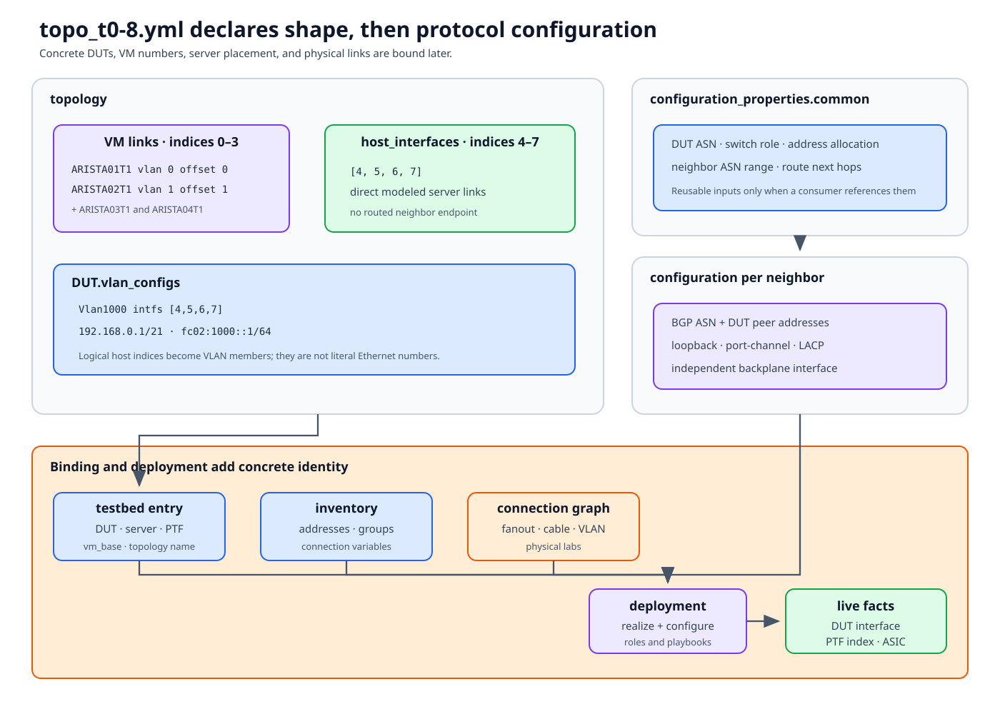

# Anatomy of a topology file

A topology variables file describes a logical network pattern. It is consumed
by deployment automation and later interpreted by tests through normalized
testbed properties and live facts. It does not name the concrete DUT, prove
physical cabling, or describe every interface created on the test server.

This chapter dissects the current `ansible/vars/topo_t0-8.yml`.



## Documentation basis

| Source | Contribution |
|---|---|
| [Testbed overview][overview] | T0 logical model and direct versus injected PTF interfaces |
| [Testbed internals][internals] | OVS, veth, VLAN, namespace, and VM realization |
| [Testbed configuration][configuration] | Relationship between topology names and testbed entries |
| `ansible/vars/topo_t0-8.yml` | Concrete example used here |
| `ansible/roles/vm_set/` and deployment playbooks | Current consumers that build topology links and configuration |

## Read the file in two passes

The top-level structure separates *shape* from *network configuration*:

```yaml
topology:                 # endpoints and link/index layout
configuration_properties: # reusable values
configuration:            # per-neighbor protocol/interface config
```

First draw endpoints and links from `topology`. Then add addresses, ASNs, and
protocols from the other sections. Mixing the passes makes a BGP peer address
look like a physical link declaration.

## `topology.host_interfaces`: direct modeled servers

```yaml
topology:
  host_interfaces:
    - 4
    - 5
    - 6
    - 7
```

For this T0 variant, indices 4–7 are downstream server-facing links exposed
directly in PTF. The deployed PTF environment normally presents them as
`eth4` through `eth7`, subject to the interface map and multi-server
placement.

“Direct” describes the test-server realization: no routed neighbor VM sits in
that logical link. A physical lab can still carry it through VLAN
subinterfaces, server trunks, root/leaf fanouts, and a cable.

`disabled_host_interfaces` can describe links that exist in the shape but
should be disabled. An empty list here means no such declaration.

## `topology.VMs`: routed neighbor endpoints

```yaml
VMs:
  ARISTA01T1:
    vlans:
      - 0
    vm_offset: 0
  ARISTA02T1:
    vlans:
      - 1
    vm_offset: 1
```

There are four logical T1 neighbors. Each has:

- a logical name used by configuration and fixtures;
- a `vm_offset` relative to the testbed entry's `vm_base`; and
- one link index in `vlans`.

The name is historical and logical; the deployed implementation may be cEOS,
vEOS, SONiC, or another supported neighbor type. Tests should rely on the
neighbor host contract and capabilities.

For T0, each neighbor-facing index 0–3 is normally realized by a three-endpoint
OVS bridge:

```text
neighbor interface + injected PTF veth + DUT-facing server VLAN
```

That is why PTF can observe and inject traffic on a routed neighbor link.

## `topology.DUT.vlan_configs`: downstream VLAN intent

```yaml
DUT:
  vlan_configs:
    default_vlan_config: one_vlan_a
    one_vlan_a:
      Vlan1000:
        id: 1000
        intfs: [4, 5, 6, 7]
        prefix: 192.168.0.1/21
        prefix_v6: fc02:1000::1/64
        tag: 1000
```

The default profile places the four direct host indices in `Vlan1000` and
declares its IPv4/IPv6 gateway prefixes.

These indices refer to logical topology links, not literal DUT
`Ethernet4`–`Ethernet7`. Minigraph generation and concrete testbed mapping
resolve them to selected DUT ports.

The VLAN ID in DUT configuration also should not be confused with the
per-link transport VLAN used on a physical test-server/fanout path. One is
network behavior presented by the DUT; the other is lab encapsulation used to
reach a cable.

## `configuration_properties`: shared inputs

The `common` block supplies values reused by neighbor configurations:

- DUT and neighbor ASNs;
- modeled device type and switch role;
- addressing/allocation parameters;
- next-hop addresses; and
- failure-injection defaults.

A property is not active merely because it is declared. Trace how the
deployment template or role consumes it. Unused historical keys can remain in
topology files, so current consumers are the final implementation reference.

## `configuration`: per-neighbor protocols and interfaces

Each neighbor references the common property set and defines:

- its ASN and DUT peer addresses;
- loopback addresses;
- a routed port-channel address;
- member interface/LACP intent; and
- a backplane interface address.

For `ARISTA01T1`:

```yaml
configuration:
  ARISTA01T1:
    properties:
      - common
    bgp:
      asn: 64600
      peers:
        65100:
          - 10.0.0.56
          - FC00::71
    interfaces:
      Port-Channel1:
        ipv4: 10.0.0.57/31
        ipv6: fc00::72/126
      Ethernet1:
        lacp: 1
    bp_interface:
      ipv4: 10.10.246.29/24
```

The BGP peer addresses are DUT-side addresses; the port-channel addresses are
neighbor-side addresses. The backplane is an independent test-server network
used for route injection/control among ExaBGP and neighbor VMs. It is not the
DUT-facing packet path.

## Bind the file to a testbed instance

`topo_t0-8.yml` still does not say which DUT or VM numbers exist. A testbed
entry adds:

```yaml
conf-name: <selected-name>
topo: t0-8
dut: [<inventory DUT>]
server: <test server>
ptf: <PTF container>
vm_base: <first neighbor instance>
```

Inventory makes those names reachable. In a physical lab, the connection
graph supplies DUT-to-fanout mappings. Deployment then creates interfaces and
configures the DUT and neighbors.

## What index 0 means at each layer

For this file, logical link index 0 belongs to `ARISTA01T1`. After
deployment it may correspond to:

| Layer | Identity |
|---|---|
| Topology | VM VLAN/link index 0 |
| Neighbor | `ARISTA01T1` interface determined by the topology |
| PTF | Injected interface for index 0 on an owning PTF host |
| Server | veth + OVS bridge + DUT-facing VLAN subinterface |
| Physical lab | connection-graph VLAN and fanout/cable path |
| DUT | Selected front-panel interface from minigraph/config facts |
| ASIC | Namespace owning that interface |

The index is a join key inside a declaration. It is not a universal port
number.

## Safe editing workflow

1. Copy the closest existing topology only after drawing the intended logical
   graph.
2. Allocate link indices once; identify each as host, VM, DUT-DUT, or
   specialized-service link.
3. Check `vm_offset` ranges against the selected `vm_base` and other active
   testbeds.
4. Validate peer/local address pairs, prefix lengths, ASNs, and VLAN
   membership.
5. Search deployment roles/templates for every non-obvious property.
6. Bind the variant to a disposable virtual testbed first when practical.
7. Inspect generated minigraph/config before deployment.
8. After deployment, verify PTF interfaces/OVS, DUT mapping, neighbor sessions,
   and route injection separately.
9. Add a topology marker only to tests whose semantics truly support the new
   shape.

## Common category errors

| Mistake | Why it fails |
|---|---|
| Treat link index as DUT port number | Concrete DUT mapping is a later stage |
| Treat DUT VLAN ID as fanout transport VLAN | They belong to different layers |
| Change `vm_offset` without checking `vm_base` | Neighbor instance collision |
| Add `configuration` without a matching VM | No endpoint consumes it |
| Add VM/link without protocol config | Topology deploys but control plane does not converge |
| Trust YAML syntax alone | Semantic and deployment consumers remain untested |
| Assume logical name fixes neighbor image | Testbed/deployment selects implementation |

The [Hands-on virtual lab](virtual-lab.md) shows how this declaration becomes
running KVM, container, OVS, and PTF state.

[overview]: https://github.com/sonic-net/sonic-mgmt/blob/master/docs/testbed/README.testbed.Overview.md
[internals]: https://github.com/sonic-net/sonic-mgmt/blob/master/docs/testbed/README.testbed.Internal.md
[configuration]: https://github.com/sonic-net/sonic-mgmt/blob/master/docs/testbed/README.new.testbed.Configuration.md
