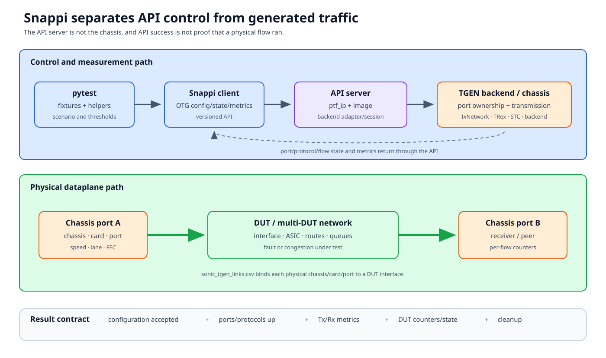

# Traffic generators and Snappi

PTF is well suited to functional packet examples. A hardware or software
traffic generator is needed when the contract depends on sustained rate, many
flows, precise timing, congestion, latency, or convergence measurement.



## Documentation basis

| Source | Contribution |
|---|---|
| [Snappi testbed integration][snappi-testbed] | Physical topology, API-server deployment, testbed fields, chassis links, and troubleshooting |
| [Snappi examples][snappi-examples] | Setup and invocation examples |
| [Snappi test README][snappi-readme] | Suite organization and execution guidance |
| `tests/snappi_tests/conftest.py` | Current fixtures and testbed API construction |
| `tests/common/snappi_tests/` | Port discovery, topology, configuration, traffic, metric, and multi-DUT helpers |
| `tests/snappi_tests/static_vs_dynamic_port_selection.md` | Port-selection models |

## API server and traffic backend are distinct roles

The control path is:

```text
pytest / Snappi client
  -> OTG/Snappi API server
  -> traffic-generator chassis/session
```

The dataplane path is:

```text
chassis card/port
  -> physical cable
  -> DUT front-panel port
  -> network under test
  -> another chassis port
```

The API server accepts configuration and returns metrics. A hardware chassis
or software traffic backend owns ports and transmits frames. The roles can be
placed differently by the implementation; API reachability does not prove
backend ownership, link state, or traffic.

Backends can include IxNetwork, TRex, STC, or another supported OTG
implementation. Keep client/API-server/backend versions compatible and record
them with results.

## Testbed binding

The physical DUT-to-generator links are listed in
`sonic_tgen_links.csv` for the documented workflow. Preserve:

```text
(DUT hostname, DUT port) ↔ (chassis, card, traffic-generator port)
```

The selected testbed entry also identifies the API environment. In the Snappi
workflow, `ptf_ip` names the API Docker management address and
`ptf_image_name` selects the API-server image; those fields do not imply a
normal PTF dataplane container. Some traditional `ptf` or `vm_base` fields
may be irrelevant for this topology.

This field reuse is why tests should consume Snappi fixtures rather than
assuming that every testbed with `ptf_ip` supports `ptfadapter`.

## Test construction layers

### 1. Port and peer discovery

Resolve each generator port to a DUT/ASIC/interface and logical role. Dynamic
selection can derive available ports from topology and constraints; static
selection fixes explicit ports. Use the model documented for the suite.

Before traffic, verify:

- chassis reservation/ownership;
- speed, lane, autonegotiation, and FEC;
- link state at both generator and DUT;
- no duplicate mapping;
- expected layer-1 settings; and
- multi-DUT peer relationships.

### 2. DUT and protocol convergence

Configure or observe DUT interfaces, IPs, BGP peers/routes, QoS state, or
feature services. OTG protocol objects can model peers and routes; wait until
both generator and DUT report the expected state.

### 3. Traffic configuration

For every flow, record:

| Contract | Example content |
|---|---|
| Endpoint | source and destination port/device |
| Headers | MAC, VLAN, IP, L4, QoS markings |
| Pattern | fixed, incrementing, route-derived |
| Load | packets/s, percentage line rate, bytes/s |
| Size/duration | frame size, fixed packets, time, continuous |
| Measurement | loss, rate, latency, ordering, convergence |
| Threshold | exact or tolerance with rationale |

Capture the generated Snappi/OTG configuration as an artifact. A helper name
is not a substitute for knowing the offered load.

### 4. Run phases

Separate:

1. port/protocol convergence;
2. warm-up;
3. baseline measurement;
4. one fault/congestion event;
5. transition interval;
6. recovery convergence; and
7. post-recovery steady state.

Clear flow metrics and DUT counters at the intended boundary. Poll state with
deadlines; avoid fixed sleeps as the only convergence criterion.

### 5. Metrics and correlated evidence

Read per-flow transmit/receive frames, rate, loss, and latency as supported.
Correlate with DUT interface/queue/PFC/ECN counters and event timestamps.

```text
expected packets = configured rate × measurement duration
observed loss = transmitted frames - received frames
```

Account for warm-up, stop behavior, metric resolution, and explicitly allowed
transition loss. A zero receive count can mean no traffic, wrong endpoint, or
stale/unavailable metrics; inspect port and flow state.

## Multi-DUT identity

Never flatten ports to one integer. Preserve:

- generator location;
- owning DUT/ASIC/interface;
- topology role and peer;
- flow endpoint role; and
- API-server/session identity.

Use multi-DUT helpers where available. They carry route and endpoint ownership
through configuration and cleanup.

## Reservation and cleanup

Traffic-generator ports are shared state. A test must stop flows/protocols,
release or reset configuration according to lab policy, and restore DUT
changes. If setup fails after reservation, cleanup still owns the session.

Do not run “safe” read-only exercises against unreserved chassis ports; even
reading/configuring a session can interfere with another owner depending on
the backend.

## Failure boundaries

| Symptom | First check |
|---|---|
| Client cannot connect | API Docker address, image/process, API version |
| API connects, chassis unavailable | Chassis address/auth/backend session |
| Port down | Cable, ownership, speed/lane/FEC |
| Protocol never converges | Address/route config on OTG and DUT |
| Flow starts, Tx remains zero | Flow endpoint/config/state |
| Tx nonzero, Rx zero | Physical mapping, DUT forwarding, destination endpoint |
| Loss varies widely | Warm-up/window, offered load, metric resolution |
| Next test cannot reserve | Session/port cleanup |

## Review checklist

- Are API server and chassis identities separate?
- Is every physical link traceable in `sonic_tgen_links.csv` and live state?
- Are versions and backend recorded?
- Is offered load reproducible from artifacts?
- Are warm-up, event, measurement, and recovery windows separate?
- Are thresholds justified against measurement resolution?
- Are ports and sessions released after partial failure?

[snappi-testbed]: https://github.com/sonic-net/sonic-mgmt/blob/master/docs/testbed/README.testbed.SnappiTests.md
[snappi-examples]: https://github.com/sonic-net/sonic-mgmt/blob/master/docs/testbed/README.testbed.Snappi.examples.md
[snappi-readme]: https://github.com/sonic-net/sonic-mgmt/blob/master/tests/snappi_tests/README.md
