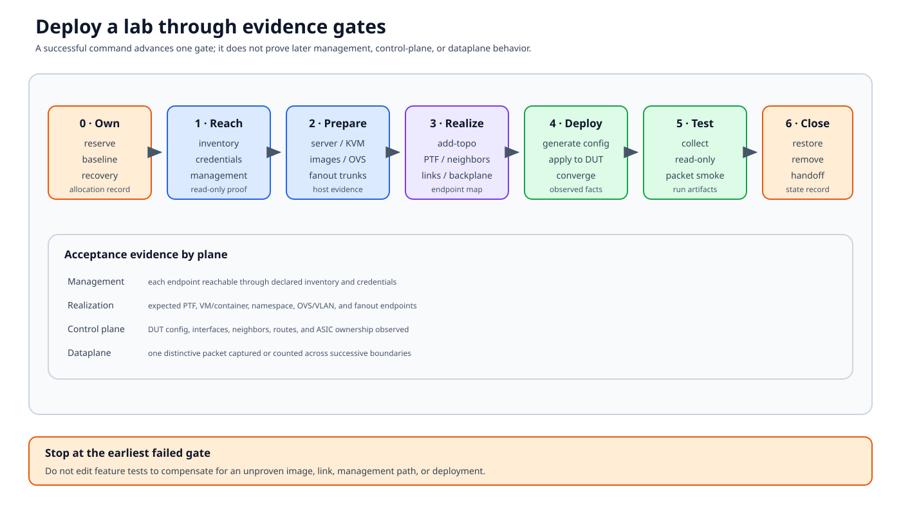

# Hands-on virtual lab

A virtual testbed preserves the logical SONiC test architecture while
replacing physical DUT/fanout/cable segments with KVM guests, containers,
Linux interfaces, and OVS. It is ideal for learning because each boundary can
be inspected on one server, but it is not proof of platform-specific hardware
behavior.



## Documentation basis

| Source | Contribution |
|---|---|
| [KVM testbed setup][vs-setup] | Host prerequisites, image preparation, inventory/testbed examples, commands, and current cEOS default |
| [Testbed internals][internals] | VM/container networks, PTF namespace, OVS, veth, VLAN, and backplane details |
| [Testbed Docker guide][docker] | Container placement and testbed services |
| `ansible/testbed-cli.sh` and called playbooks | Current operation dispatch |
| `ansible/vtestbed.yaml`, `veos_vtb`, and topology vars | Example bindings shipped with the repository |

Read the complete KVM guide for the branch before provisioning. Image names,
registries, host packages, and command options change more often than the
architecture.

## Placement model

A small virtual T0 commonly places these components on one Linux test server:

- a virtual SONiC DUT running in KVM;
- cEOS containers or VM-based routed neighbors;
- a PTF container;
- a management bridge;
- OVS bridges and veth pairs for neighbor-facing links;
- direct PTF interfaces for modeled servers; and
- backplane bridges/services for route injection.

The management container or shell running `sonic-mgmt` can be on that server
or elsewhere, provided inventory and management routing reach every endpoint.

For `vtestbed`, the current setup guide notes that `add-topo` and
`remove-topo` also create/remove the KVM DUT and recreate an existing one.
That is materially destructive to DUT-local state; do not run it against an
environment another user expects to preserve.

## Gate 0: reserve and inspect

Before any command, record:

- test server and owner;
- selected `conf-name`;
- DUT inventory name;
- topology variant;
- PTF/container name;
- `vm_base` and neighbor count;
- SONiC and neighbor image versions; and
- management bridge/subnet.

Inspect the matching entry in `ansible/vtestbed.yaml`, DUT in
`ansible/veos_vtb`, topology vars, and password/inventory inputs. Confirm the
VM range does not overlap an active testbed.

**Evidence:** a written allocation and read-only management reachability to the
server.

## Gate 1: prepare the host and images

Verify CPU virtualization, KVM device access, memory/disk, bridge/network
configuration, required packages, Docker, and the expected SONiC/neighbor/PTF
images. The authoritative commands are in [KVM testbed setup][vs-setup].

Do not debug topology YAML while the base image cannot boot or the host cannot
create a bridge.

**Evidence:** image identifiers/digests, KVM capability, free resources, and
successful host-level smoke checks.

## Gate 2: start neighbor capacity

For a four-neighbor setup, the guide's command shape is:

```console
cd ansible
./testbed-cli.sh -m veos_vtb -n 4 -k veos +  start-vms server_1 password.txt
```

Use `-k vsonic` only for SONiC neighbor images. Current `add-topo` defaults
to cEOS when `-k` is omitted; follow the exact branch guide and selected
testbed.

**Evidence:** expected VM/container instances, management addresses, and no
collision with another topology.

## Gate 3: realize links and PTF

```console
./testbed-cli.sh -t vtestbed.yaml -m veos_vtb +  add-topo vms-kvm-t0 password.txt
```

`add-topo` creates the PTF environment and realizes the logical links. It is
not just “start four routers.”

Inspect on the server:

- PTF container and management `mgmt` interface;
- expected `ethN` interfaces inside PTF;
- veth pairs and OVS bridge membership;
- OVS flows for injected neighbor links;
- direct host-interface placement;
- neighbor dataplane interfaces; and
- backplane bridges/interfaces.

**Evidence:** an endpoint-to-endpoint map for one direct and one injected
interface.

## Gate 4: generate and deploy DUT configuration

```console
./testbed-cli.sh -t vtestbed.yaml -m veos_vtb +  deploy-mg vms-kvm-t0 veos_vtb password.txt
```

`deploy-mg` generates and applies topology-aware DUT configuration.
`gen-mg` can be used separately when you need to inspect generated output
before application. Options such as IPv6-only management are branch/workflow
specific.

Validate:

- DUT management reachability after reload;
- active configuration and topology name;
- interface/admin/oper state;
- port-channel membership;
- BGP neighbor state;
- learned routes; and
- minigraph PTF indices.

**Evidence:** generated configuration plus observed post-deploy facts.

## Gate 5: run progressively

Start with collection and read-only facts before traffic:

```console
cd ../tests
./run_tests.sh -n vms-kvm-t0 -d vlab-01 \
  -c bgp/test_bgp_fact.py -f vtestbed.yaml \
  -i ../ansible/veos_vtb
```

Use names and options from your environment. Then:

1. collect one node ID;
2. run a read-only management/control-plane check;
3. run a PTF-agent or simple dataplane smoke test; and
4. only then run a feature or disruptive suite.

**Evidence:** command, selected node ID/parameters, logs, result XML, and the
first packet-path capture if applicable.

## Gate 6: remove or hand off

```console
cd ../ansible
./testbed-cli.sh -t vtestbed.yaml -m veos_vtb +  remove-topo vms-kvm-t0 password.txt
```

Stop shared neighbor capacity only when no other topology uses it. Record
whether the environment was removed, left deployed, or handed to another
owner. Check for stale containers, bridges, interfaces, and VM allocations.

## Failure localization

| Symptom | First boundary |
|---|---|
| DUT/neighbor image will not start | Host capability, image, memory/disk |
| `add-topo` fails | Testbed binding, stale resources, PTF image, bridge state |
| Expected PTF `ethN` absent | Topology indices, namespace/interface creation |
| Neighbor sees no DUT link | OVS membership/flows and link mapping |
| DUT unreachable after deploy | Generated management config, inventory route |
| Interfaces up but BGP down | Address/ASN config, neighbor process, OVS link |
| Control-plane tests pass, packets fail | PTF mapping and virtual dataplane |
| Virtual passes, hardware fails | Physical/platform behavior outside this model |

## What virtual testing cannot establish

KVM/VPP/virtual ASIC and virtual links do not reproduce optics, FEC, cable
quality, fanout trunks, hardware buffer behavior, SDK/ASIC timing, power
events, or every reboot path. Use a virtual lab to validate topology,
management, control logic, and broad forwarding contracts; use hardware for
hardware claims.

[vs-setup]: https://github.com/sonic-net/sonic-mgmt/blob/master/docs/testbed/README.testbed.VsSetup.md
[internals]: https://github.com/sonic-net/sonic-mgmt/blob/master/docs/testbed/README.testbed.Internal.md
[docker]: https://github.com/sonic-net/sonic-mgmt/blob/master/docs/testbed/README.testbed.Docker.md
